# Clinex — System Design Document

> **Final Year Project (FYP) Defense Manuscript**
> Clinical Medical Records Digitization System with AI-Powered OCR Pipeline

---

# REQUIREMENT MODELLING

This section outlines the functional and non-functional requirements of the Clinex system through various modeling techniques. It defines how data enters the system, how it is processed using advanced Artificial Intelligence (AI) and Optical Character Recognition (OCR) pipelines, and how it is ultimately stored and presented to the users. By modeling the requirements comprehensively, we ensure that the system architecture aligns perfectly with the operational needs of hospital laboratories.

## 1. Input-Process-Output (IPO)

The Input-Process-Output (IPO) model serves as the foundational framework for understanding the core functionality of the Clinex system. It delineates the boundaries of the system by identifying what raw materials (inputs) are required, what transformative actions (processes) are applied to those materials, and what valuable information (outputs) is generated as a result. In the context of this medical digitization platform, the IPO model is crucial for mapping the journey of a physical lab report into a structured, queryable digital record.

Rather than condensing the entire system into a single abstracted view, this section first presents the high-level overview (Figure 1.1) and then systematically decomposes every functional module into its own dedicated IPO diagram. This granular approach enables precise understanding of what each component receives, how it transforms the data, and what it produces for the next stage in the pipeline.

### 1.1 System-Level IPO Overview

Figure 1.1 provides the bird's-eye view of the Clinex system. At this abstraction level, we identify five categories of external inputs feeding into the system, nine core processing modules arranged sequentially and in parallel, and six categories of output produced for end-users and downstream processes.

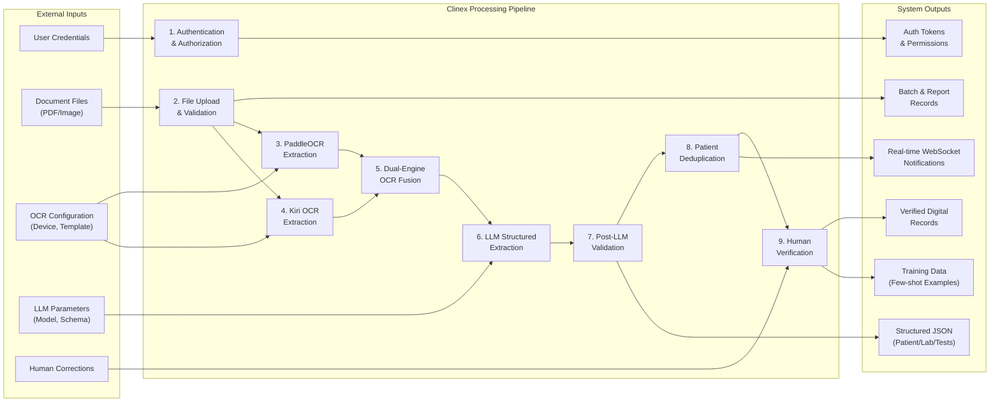

> **Figure 1.1:** System-level IPO overview of the Clinex system showing five input categories, nine processing modules, and six output categories.

### 1.2 Module Summary Table

Table 1.1 provides a consolidated summary of all nine functional modules, listing the primary inputs consumed and outputs produced by each module. This serves as a quick reference for the detailed per-module diagrams that follow.

> **Table 1.1:** Module summary — inputs and outputs for all nine processing modules.

| # | Module | Primary Inputs | Primary Outputs |
|---|--------|---------------|-----------------|
| 1 | Authentication & Authorization | Email, Password | Bearer Token, User Object, Permissions |
| 2 | File Upload & Validation | Files, Document Type, Template ID | ReportBatch, LabReport Records, Queue Job |
| 3 | PaddleOCR Extraction | File Path, Device Config | Raw English Text, Bounding Boxes, Confidence |
| 4 | Kiri OCR Extraction | Page Image, Device Config | Khmer Unicode Text, Confidence Scores |
| 5 | Dual-Engine OCR Fusion | PaddleOCR Text, Kiri Text, Confidences | Fused OCR Text, Overall Confidence |
| 6 | LLM Structured Extraction | Fused Text, Template Schema, Model Name | patientInfo, labInfo, testResults[] |
| 7 | Post-LLM Validation | Raw JSON, Anchors, Flags, Units | Validated JSON, Confidence Score |
| 8 | Patient Deduplication | Validated JSON, Patients Table | Patient Record, Updated LabReport |
| 9 | Human Verification | Processed Report, Original File, Corrections | Verified Report, Training Examples |

### 1.3 Per-Module IPO Decomposition

The following subsections present two diagrams per module. The first is an **Input/Output Diagram** showing required inputs entering on the left and provided outputs exiting on the right, with each individual process rendered as its own box inside a system boundary — following the UML Component Diagram convention with socket (input) and lollipop (output) connectors. The second is a **Process Diagram** decomposing the internal logic within that module as a flowchart. Together they provide complete visibility into what each component needs, how it works, and what it produces.

#### 1.3.1 Module 1 — Authentication & Authorization

This module serves as the system's entry point. It validates user credentials against stored bcrypt hashes and generates a session token that accompanies all subsequent API requests. The token carries the user's role and granular permissions, which downstream modules use to enforce access control.

**Input/Output Diagram:**

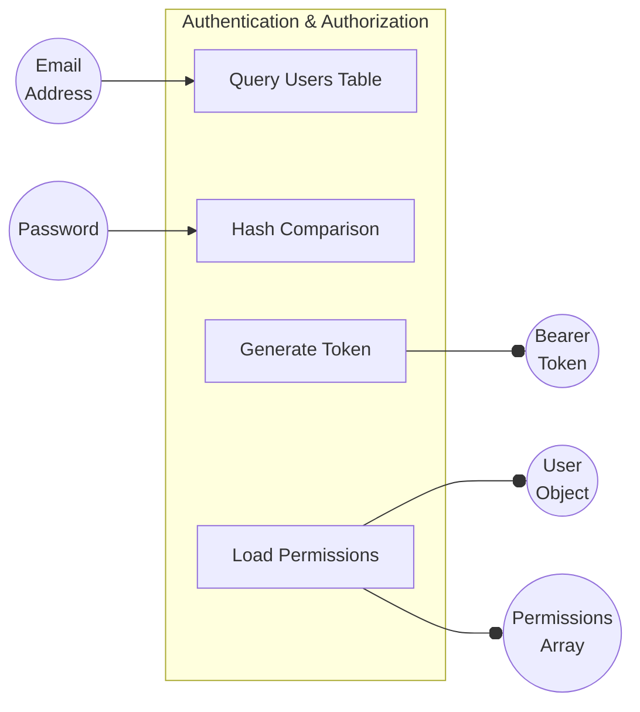

> **Figure 1.3a:** Input/Output diagram for Module 1 — Authentication & Authorization. Two inputs (credentials) produce three outputs (token, user profile, permissions).

**Process Diagram:**

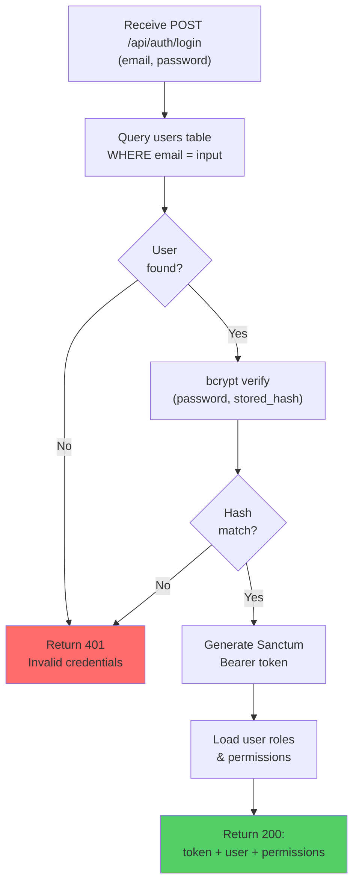

> **Figure 1.3b:** Process diagram for Module 1 — showing credential validation flow with bcrypt hash comparison and Sanctum token generation.

> **Table 1.1a:** Input/Output specification for Module 1 — Authentication & Authorization.

| Direction | Item | Data Type | Description |
|-----------|------|-----------|-------------|
| **Input** | Email Address | String (email) | Registered hospital staff email address |
| **Input** | Password | String | Plain text password for bcrypt comparison |
| **Output** | Bearer Token | String (Sanctum) | Authentication token for all subsequent API calls |
| **Output** | User Object | JSON | User profile including id, name, email, role |
| **Output** | Permissions Array | JSON Array | Granular permission set (e.g., `manage reports`, `verify reports`) |

---

#### 1.3.2 Module 2 — File Upload & Validation

This module handles the ingestion of physical documents into the system. It accepts up to 20 files per batch, validates MIME types and file sizes, computes SHA-256 hashes for duplicate detection, and persists files to disk while creating the necessary database records. Upon successful validation, it dispatches a queue job to begin asynchronous processing.

**Input/Output Diagram:**

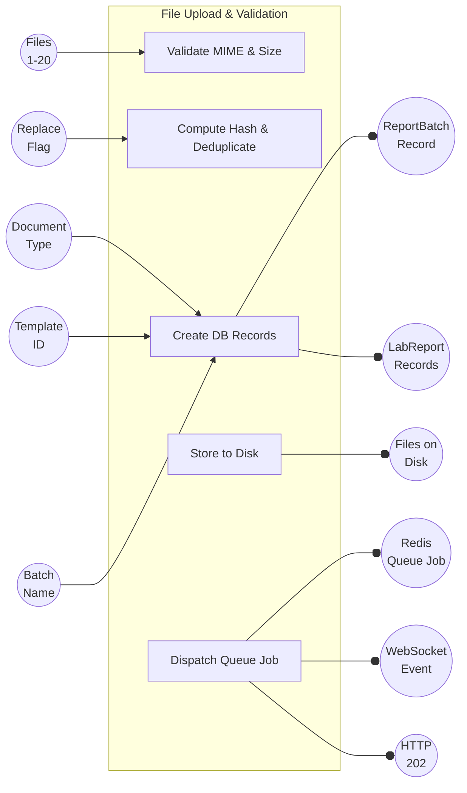

> **Figure 1.4a:** Input/Output diagram for Module 2 — File Upload & Validation. Five inputs produce six outputs including database records, filesystem storage, and an asynchronous queue job.

**Process Diagram:**

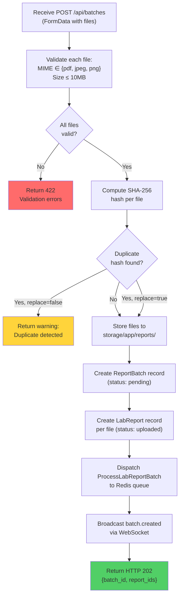

> **Figure 1.4b:** Process diagram for Module 2 — showing file validation, hash-based deduplication, storage, and asynchronous queue dispatch.

> **Table 1.2:** Input/Output specification for Module 2 — File Upload & Validation.

| Direction | Item | Data Type | Description |
|-----------|------|-----------|-------------|
| **Input** | Files (1-20) | Binary (PDF/JPEG/PNG) | Scanned lab report documents, max 10MB each |
| **Input** | Document Type | Enum string | `lab_result` or `consultation` |
| **Input** | Template ID | Integer (FK) | References extraction template schema |
| **Input** | Batch Name | String (optional) | Human-readable batch label |
| **Input** | Replace Flag | Boolean | If true, allow overwriting duplicate files |
| **Output** | ReportBatch Record | DB Record | Parent batch with status, counts, metadata |
| **Output** | LabReport Records | DB Records | One per file with status=uploaded |
| **Output** | Files on Disk | Binary files | Stored at `storage/app/reports/{batch_id}/` |
| **Output** | Redis Queue Job | Queue payload | Serialized job for background processing |
| **Output** | WebSocket Event | Pusher event | Real-time `batch.created` notification |
| **Output** | HTTP 202 | JSON response | Confirmation with batch_id and report_ids |

---

#### 1.3.3 Module 3 — PaddleOCR Extraction

PaddleOCR is the primary engine for extracting English text and numeric values from scanned laboratory reports. It processes all pages of a document, performing text detection (locating text regions) followed by text recognition (converting pixel regions to character strings). This module runs exclusively on CPU to preserve GPU VRAM for the LLM inference stage.

**Input/Output Diagram:**

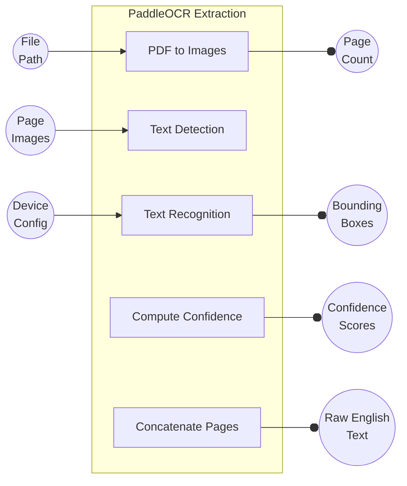

> **Figure 1.5a:** Input/Output diagram for Module 3 — PaddleOCR Extraction. Three inputs produce four outputs including raw text, spatial coordinates, and confidence metrics.

**Process Diagram:**

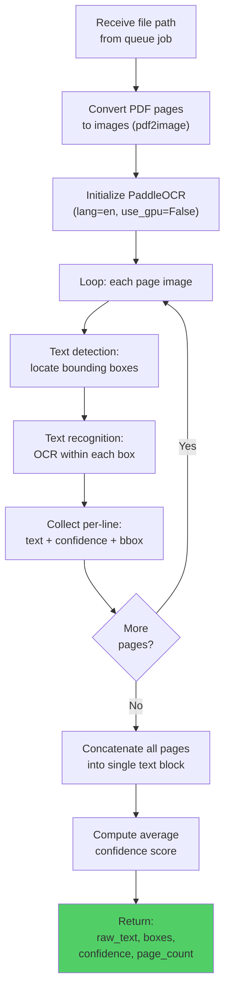

> **Figure 1.5b:** Process diagram for Module 3 — showing the per-page OCR loop with text detection, recognition, and confidence aggregation.

> **Table 1.3:** Input/Output specification for Module 3 — PaddleOCR Extraction.

| Direction | Item | Data Type | Description |
|-----------|------|-----------|-------------|
| **Input** | File Path | String (path) | Absolute path to uploaded PDF or image file |
| **Input** | Page Images | PIL Image[] | Converted page images from PDF (via pdf2image) |
| **Input** | Device Config | String | `cpu` (forced to preserve GPU for LLM) |
| **Output** | Raw English Text | String | Concatenated OCR text from all pages |
| **Output** | Bounding Boxes | Array[[x,y,w,h]] | Spatial coordinates of each detected text region |
| **Output** | Confidence Scores | Float[] | Per-line recognition confidence (0.0–1.0) |
| **Output** | Page Count | Integer | Number of pages processed |

---

#### 1.3.4 Module 4 — Kiri OCR Extraction

Kiri OCR is a specialized transformer-based model fine-tuned for Khmer (Cambodian) script recognition. Unlike PaddleOCR which processes all pages, Kiri OCR focuses only on Page 1, where patient demographic information (typically written in Khmer) is concentrated. This targeted approach reduces processing time while capturing the most linguistically challenging content.

**Input/Output Diagram:**

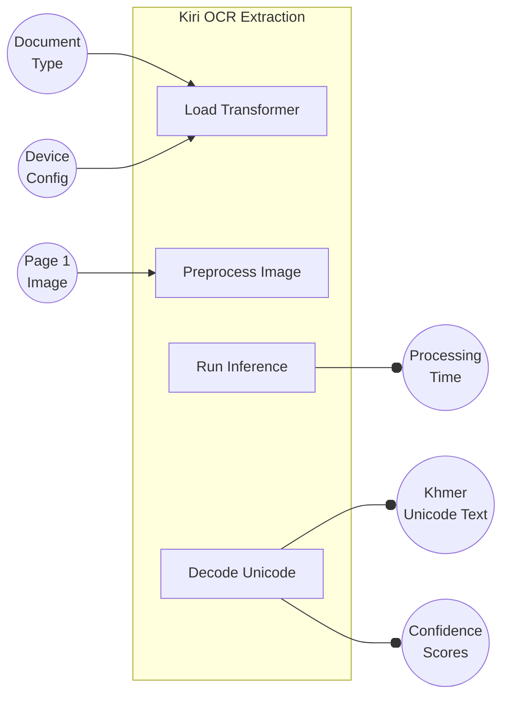

> **Figure 1.6a:** Input/Output diagram for Module 4 — Kiri OCR Extraction. Three inputs produce three outputs focused on Khmer script recognition from page 1.

**Process Diagram:**

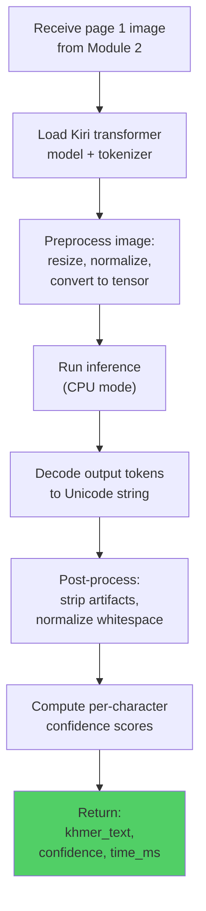

> **Figure 1.6b:** Process diagram for Module 4 — showing transformer model loading, image preprocessing, inference, and Unicode decoding.

> **Table 1.4:** Input/Output specification for Module 4 — Kiri OCR Extraction.

| Direction | Item | Data Type | Description |
|-----------|------|-----------|-------------|
| **Input** | Page 1 Image | PIL Image | First page image containing Khmer patient demographics |
| **Input** | Device Config | String | `cpu` (transformer inference on CPU) |
| **Input** | Document Type | String | Used to select appropriate model checkpoint |
| **Output** | Khmer Unicode Text | String (UTF-8) | Recognized Khmer script text in Unicode encoding |
| **Output** | Confidence Scores | Float[] | Per-character recognition confidence |
| **Output** | Processing Time | Integer (ms) | Wall-clock time for inference |

---

#### 1.3.5 Module 5 — Dual-Engine OCR Fusion

The Dual-Engine Fusion module is the core novel logic of the Clinex OCR pipeline. It receives the outputs of both PaddleOCR (English-optimized) and Kiri OCR (Khmer-optimized) and performs per-line script detection to determine whether each line is primarily Khmer or English. Based on this detection, it selects the most reliable engine output for each line, producing a single unified text that combines the strengths of both engines.

**Input/Output Diagram:**

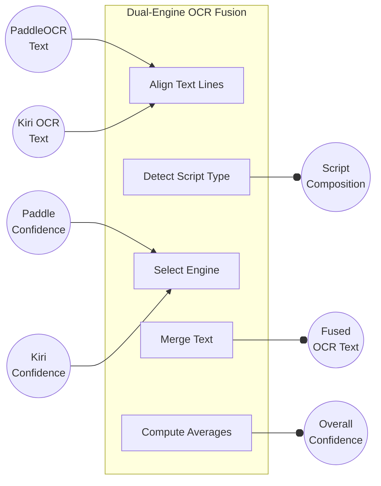

> **Figure 1.7a:** Input/Output diagram for Module 5 — Dual-Engine OCR Fusion. Four inputs from two parallel OCR engines merge into three unified outputs.

**Process Diagram:**

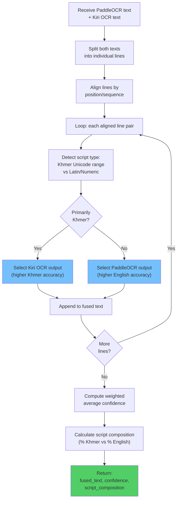

> **Figure 1.7b:** Process diagram for Module 5 — showing the per-line script detection and engine selection logic that forms the core fusion algorithm.

> **Table 1.5:** Input/Output specification for Module 5 — Dual-Engine OCR Fusion.

| Direction | Item | Data Type | Description |
|-----------|------|-----------|-------------|
| **Input** | PaddleOCR Text | String | Raw text output from Module 3 |
| **Input** | Paddle Confidence | Float | Average confidence from PaddleOCR |
| **Input** | Kiri OCR Text | String | Raw Khmer text output from Module 4 |
| **Input** | Kiri Confidence | Float | Average confidence from Kiri OCR |
| **Output** | Fused OCR Text | String | Best-of-both-engines merged text |
| **Output** | Overall Confidence | Float | Weighted average confidence across all lines |
| **Output** | Script Composition | JSON | Percentage breakdown of Khmer vs English content |

---

#### 1.3.6 Module 6 — LLM Structured Extraction

This module leverages a locally hosted Large Language Model (Ollama phi3:mini) to transform unstructured OCR text into structured JSON. It constructs a carefully engineered prompt containing the template schema, extraction rules, and few-shot examples, then sends the fused OCR text to the LLM for inference. The LLM extracts patient information, lab metadata, and individual test results into a standardized schema.

**Input/Output Diagram:**

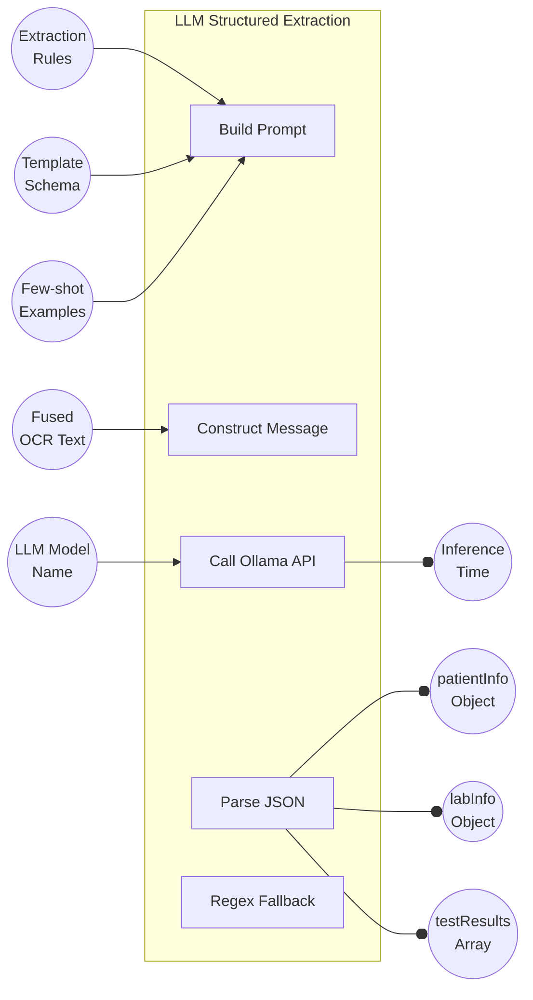

> **Figure 1.8a:** Input/Output diagram for Module 6 — LLM Structured Extraction. Five inputs (text, schema, examples, rules, model) produce four structured JSON outputs.

**Process Diagram:**

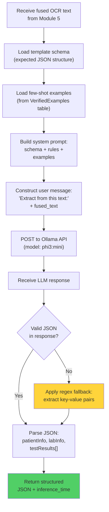

> **Figure 1.8b:** Process diagram for Module 6 — showing prompt construction, Ollama API invocation, JSON parsing, and regex fallback for malformed LLM output.

> **Table 1.6:** Input/Output specification for Module 6 — LLM Structured Extraction.

| Direction | Item | Data Type | Description |
|-----------|------|-----------|-------------|
| **Input** | Fused OCR Text | String | Merged text from Module 5's dual-engine fusion |
| **Input** | Template Schema | JSON | Expected output structure (patientInfo, labInfo, testResults) |
| **Input** | Few-shot Examples | JSON[] | Previously verified input/output pairs for in-context learning |
| **Input** | Extraction Rules | String | Domain-specific rules (e.g., flag normalization, unit mapping) |
| **Input** | LLM Model Name | String | Ollama model identifier (default: `phi3:mini`) |
| **Output** | patientInfo Object | JSON | Patient demographics: name, ID, age, gender, etc. |
| **Output** | labInfo Object | JSON | Lab metadata: hospital, doctor, dates, sample type |
| **Output** | testResults Array | JSON[] | Array of {test_name, result, unit, flag, reference_range} |
| **Output** | Inference Time | Integer (ms) | Wall-clock time for LLM inference |

---

#### 1.3.7 Module 7 — Post-LLM Validation & Normalization

After the LLM produces structured JSON, this module applies a series of rule-based validations and normalizations. It enforces valid flag values (H/L/N/A), normalizes measurement units to standard forms, cleans test category labels, and applies hospital-specific anchor text patterns to improve accuracy. This stage acts as a safety net that catches and corrects common LLM hallucinations.

**Input/Output Diagram:**

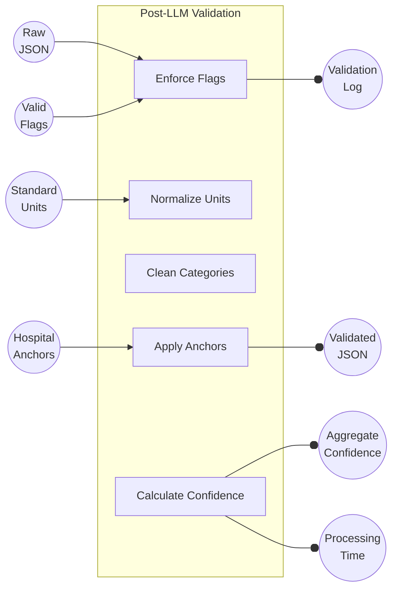

> **Figure 1.9a:** Input/Output diagram for Module 7 — Post-LLM Validation & Normalization. Four inputs (raw JSON plus rule sets) produce four validated outputs.

**Process Diagram:**

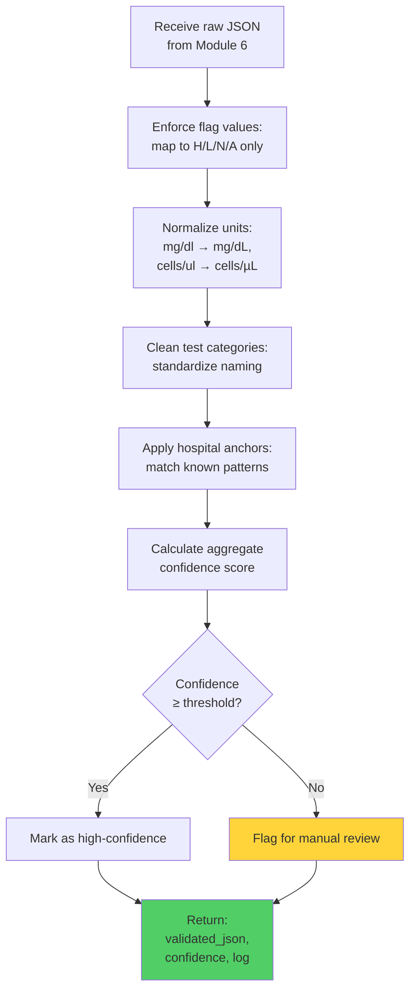

> **Figure 1.9b:** Process diagram for Module 7 — showing the validation pipeline with flag enforcement, unit normalization, anchor matching, and confidence scoring.

> **Table 1.7:** Input/Output specification for Module 7 — Post-LLM Validation & Normalization.

| Direction | Item | Data Type | Description |
|-----------|------|-----------|-------------|
| **Input** | Raw JSON | JSON | Unvalidated LLM output from Module 6 |
| **Input** | Hospital Anchors | JSON | Hospital-specific text patterns for accuracy improvement |
| **Input** | Valid Flags | Enum[] | Allowed flag values: H (High), L (Low), N (Normal), A (Abnormal) |
| **Input** | Standard Units | Map | Unit normalization map (e.g., mg/dl → mg/dL) |
| **Output** | Validated JSON | JSON | Cleaned and normalized extraction result |
| **Output** | Aggregate Confidence | Float | Combined confidence from OCR + LLM + validation |
| **Output** | Processing Time | Integer (ms) | Validation processing duration |
| **Output** | Validation Log | JSON | Record of all normalizations and corrections applied |

---

#### 1.3.8 Module 8 — Patient Deduplication & Record Linking

This module prevents duplicate patient records by extracting the patient identifier from the validated JSON and querying the existing patients table. If a matching patient is found, the lab report is linked to the existing record; otherwise, a new patient record is created. This ensures data integrity across multiple lab report uploads for the same patient.

**Input/Output Diagram:**

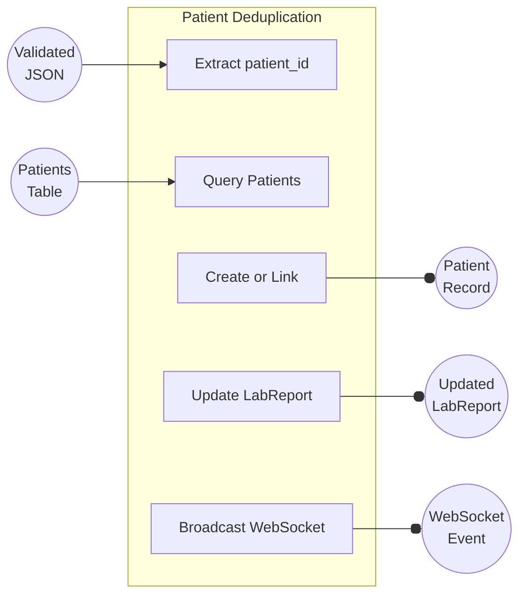

> **Figure 1.10a:** Input/Output diagram for Module 8 — Patient Deduplication & Record Linking. Two inputs produce three outputs linking the report to a deduplicated patient.

**Process Diagram:**

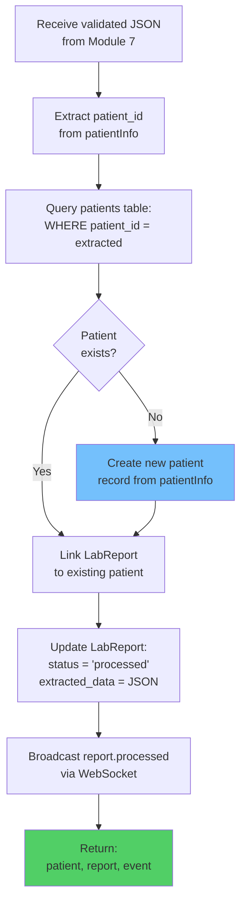

> **Figure 1.10b:** Process diagram for Module 8 — showing patient lookup, deduplication logic, record linking, and real-time event broadcasting.

> **Table 1.8:** Input/Output specification for Module 8 — Patient Deduplication & Record Linking.

| Direction | Item | Data Type | Description |
|-----------|------|-----------|-------------|
| **Input** | Validated JSON | JSON | Complete extraction with patientInfo containing patient_id |
| **Input** | Patients Table | DB Table | Existing patient records for deduplication lookup |
| **Output** | Patient Record | DB Record | New or existing patient linked to this report |
| **Output** | Updated LabReport | DB Record | Status changed to `processed`, extracted_data populated |
| **Output** | WebSocket Event | Pusher event | Real-time `report.processed` notification to frontend |

---

#### 1.3.9 Module 9 — Human Verification & Training

The final module in the pipeline provides a human-in-the-loop verification interface. Lab technicians review the AI-extracted data side-by-side with the original scanned document, correct any errors, and mark the report as verified. Optionally, verified corrections can be saved as training examples that improve future LLM extractions through few-shot learning — creating a continuous improvement feedback loop.

**Input/Output Diagram:**

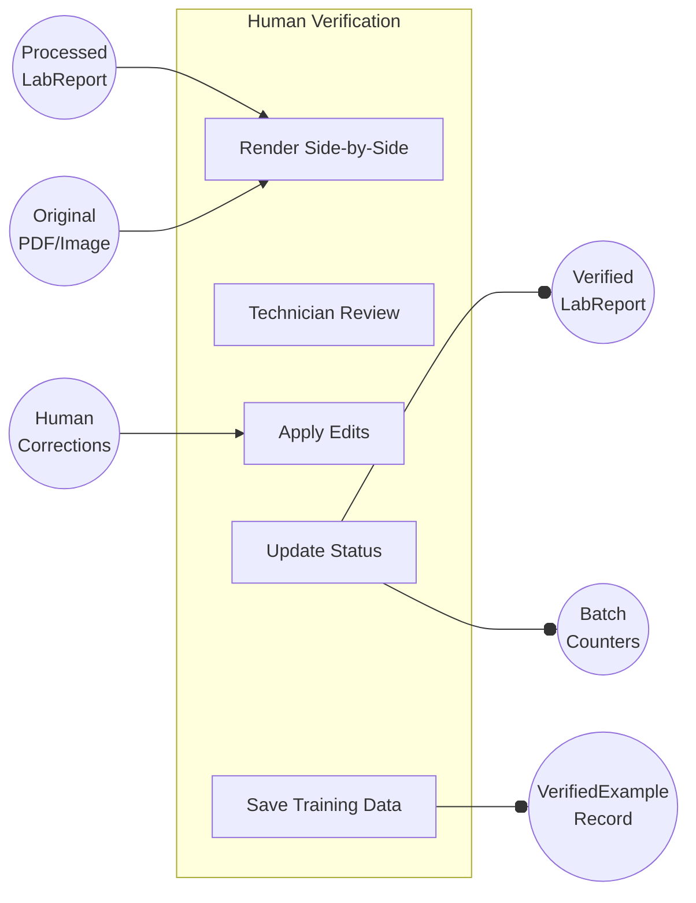

> **Figure 1.11a:** Input/Output diagram for Module 9 — Human Verification & Training. Three inputs produce three outputs, with the VerifiedExample creating a feedback loop to Module 6.

**Process Diagram:**

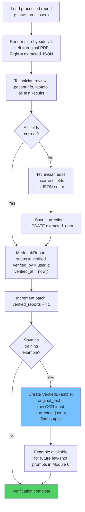

> **Figure 1.11b:** Process diagram for Module 9 — showing the side-by-side review, correction workflow, and optional training data collection that creates a continuous improvement loop.

> **Table 1.9:** Input/Output specification for Module 9 — Human Verification & Training.

| Direction | Item | Data Type | Description |
|-----------|------|-----------|-------------|
| **Input** | Processed LabReport | DB Record | Report with status=processed and populated extracted_data |
| **Input** | Original Document | PDF/Image file | Scanned document for visual comparison |
| **Input** | Human Corrections | JSON edits | Technician's corrections to specific fields |
| **Output** | Verified LabReport | DB Record | Status updated to `verified`, verified_by and verified_at set |
| **Output** | Batch Counters | DB Update | verified_reports counter incremented on parent batch |
| **Output** | VerifiedExample | DB Record (optional) | original_text + corrected_json pair for future few-shot learning |

### 1.4 End-to-End Data Flow

To complement the per-module IPO views, Figure 1.12 maps the complete data flow sequence across all system boundaries. This highlights the interaction between the frontend, backend, Redis queue, Python pipeline, and external services.

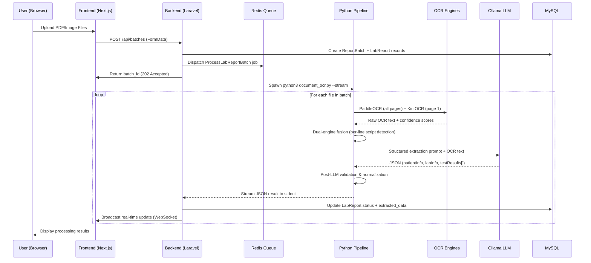

> **Figure 1.12:** End-to-end sequence diagram showing the complete data flow from user upload through all nine modules to final result display.

---

## 2. Performance Modeling

Performance is a critical constraint for the Clinex system, as the AI pipeline is computationally intensive. The system must process documents within an acceptable timeframe for hospital staff while operating within the hardware limitations of a local deployment (typically consumer-grade GPUs). This section models the expected performance and resource allocation strategies to prevent bottlenecks, specifically the Out-of-Memory (OOM) errors that can occur when OCR and LLM engines compete for VRAM.

### 2.1 Processing Timeline (Per File)

Figure 2.1 illustrates the timeline for processing a single laboratory report. By separating the OCR execution (CPU) from the LLM execution (GPU), we optimize the pipeline for environments with limited VRAM (e.g., 6GB on an RTX 3060). 

```mermaid
gantt
    title Per-File Processing Timeline (GPU-Accelerated)
    dateFormat ss
    axisFormat %S s

    section OCR Phase
    PaddleOCR - All Pages       :a1, 00, 15s
    Kiri OCR - Page 1 Only      :a2, 05, 15s
    OCR Fusion                  :a3, after a2, 3s

    section LLM Phase
    Ollama phi3 Inference       :b1, after a3, 40s

    section Post-Processing
    Validation and Normalization :c1, after b1, 5s
    Patient Deduplication       :c2, after c1, 3s
    Database Write              :c3, after c2, 2s
```

> **Figure 2.1:** Gantt chart showing the per-file processing timeline on GPU-accelerated hardware (RTX 3060), with OCR, LLM inference, and post-processing phases.

### 2.2 Performance Benchmark Comparison

Different hospital environments will deploy varying hardware setups. Table 2.1 provides performance benchmarks across CPU-only systems, entry-level GPUs, and optimal GPU configurations.

> **Table 2.1:** Performance benchmark comparison across three hardware configurations.

| Metric | CPU-Only Mode | GPU (RTX 3060) | Target (RTX 4070) |
|--------|---------------|---------------------------|-------------------|
| **PaddleOCR per page** | 8–12s | 3–5s | 2–3s |
| **Kiri OCR per page** | 30–45s | 10–15s | 6–10s |
| **LLM inference per file** | 2–4 min | 30–50s | 20–30s |
| **Total per file (3-page lab)** | 3–5 min | 50–75s | 30–45s |
| **Batch of 4 files** | 15–20 min | 4–5 min | 2–3 min |
| **Batch of 20 files (max)** | ~90 min | ~25 min | ~15 min |
| **Concurrent workers** | 1 | 1 (VRAM limit) | 1–2 |
| **Queue throughput** | ~15 files/hr | ~50 files/hr | ~80 files/hr |

### 2.3 Resource Allocation Strategy

To maximize throughput and ensure system stability, resources must be strictly partitioned. Figure 2.2 demonstrates the strategy of pinning OCR tasks to the CPU, reserving the scarce GPU VRAM entirely for the memory-heavy LLM inference process.

```mermaid
graph TB
    subgraph "CPU Resources (16GB RAM)"
        CPU_OCR["PaddleOCR Engine\n(CPU Mode)"]
        CPU_KIRI["Kiri OCR Engine\n(CPU Mode)"]
        CPU_PHP["Laravel App\n+ Queue Worker"]
        CPU_NEXT["Next.js Frontend"]
        CPU_MYSQL["MySQL Database"]
        CPU_REDIS["Redis Cache/Queue"]
    end

    subgraph "GPU Resources (RTX 3060 - 6GB VRAM)"
        GPU_LLM["Ollama LLM\n(phi3:mini)\nFull 6GB VRAM\nExclusive Access"]
    end

    CPU_OCR -->|"OCR text"| GPU_LLM
    CPU_KIRI -->|"Khmer text"| GPU_LLM
    CPU_PHP -->|"Queue dispatch"| CPU_OCR
    CPU_PHP -->|"Queue dispatch"| CPU_KIRI
    GPU_LLM -->|"JSON result"| CPU_PHP
    CPU_PHP --> CPU_MYSQL
    CPU_PHP --> CPU_REDIS
```

> **Figure 2.2:** Resource allocation diagram showing the CPU/GPU split strategy. OCR engines run on CPU to reserve the full 6GB VRAM exclusively for Ollama LLM inference.

### 2.4 Scalability Model

Table 2.2 proposes scalable hardware solutions based on the daily volume of laboratory reports expected at the deployment site.

> **Table 2.2:** Scalability model mapping hospital size to recommended hardware and expected throughput.

| Hospital Size | Daily Reports | Recommended Hardware | Processing Time |
|---------------|---------------|---------------------|-----------------|
| **Small Clinic** | <20 reports/day | Any office PC (CPU-only) | ~3–5 min/file |
| **Medium Hospital** | 20–100 reports/day | PC + RTX 4060 (8GB) | ~40–50s/file |
| **Large Hospital** | 100+ reports/day | Workstation + RTX 4070 (12GB) | ~25–35s/file |

---

## 3. Control Diagram

The control modeling phase maps the decision-making logic and state transitions within the application. These models define how the system reacts to user inputs, handles background processing tasks, and secures access to sensitive endpoints.

### 3.1 Document Processing State Machine

A laboratory report undergoes several status changes as it moves through the system. Figure 3.1 models these state transitions, ensuring that the system can gracefully handle failures and allow for manual intervention via human verification.

```mermaid
stateDiagram-v2
    [*] --> Uploaded : User uploads file

    Uploaded --> Processing : Queue worker picks up job
    Processing --> Processed : OCR + LLM extraction succeeds
    Processing --> Failed : OCR/LLM error or timeout

    Processed --> Verified : Human reviews and approves
    Processed --> Failed : Human rejects extraction

    Failed --> Processing : User retries processing

    Verified --> [*] : Record finalized

    state Processing {
        [*] --> OCR_Running
        OCR_Running --> Fusion : Both engines complete
        Fusion --> LLM_Running : Fused text ready
        LLM_Running --> PostValidation : JSON extracted
        PostValidation --> [*] : Validation passes
    }
```

> **Figure 3.1:** State machine diagram showing the lifecycle of a lab report document, from initial upload through processing, verification, and finalization. The nested states within "Processing" show the internal OCR pipeline stages.

### 3.2 Batch Processing Control Flow

When a batch of documents is uploaded, a complex series of backend validations, queue dispatches, and Python subprocess executions occur. Figure 3.2 outlines this detailed control flow, including duplicate detection, AI model fallbacks, and queue worker cleanup protocols.

```mermaid
flowchart TD
    A["User uploads files\n(1-20 per batch)"] --> B["Backend validates files\n(MIME, size, hash)"]
    B --> C{"Duplicate\ndetected?"}
    C -->|"No"| D["Create ReportBatch\n+ LabReport records"]
    C -->|"Yes, replace=true"| D
    C -->|"Yes, replace=false"| E["Return duplicate\nwarning to user"]
    D --> F["Dispatch to Redis\nqueue as job"]
    F --> G["Queue worker picks up batch"]
    G --> H["Spawn Python subprocess"]
    H --> I["Loop: process each file"]
    I --> J{"OCR\nconfidence\n>= 0.85?"}
    J -->|"Yes"| K["Use local OCR\n(PaddleOCR + Kiri)"]
    J -->|"No"| L["Fallback to\nGoogle Document AI"]
    K --> M["LLM extraction\n(Ollama phi3:mini)"]
    L --> M
    M --> N{"LLM\nsuccess?"}
    N -->|"Yes"| O["Post-validation\n& normalization"]
    N -->|"No"| P["Regex fallback parser"]
    P --> O
    O --> Q["Stream JSON result to PHP"]
    Q --> R["Update report status in DB"]
    R --> S["Broadcast WebSocket event"]
    S --> T{"More files\nin batch?"}
    T -->|"Yes"| I
    T -->|"No"| U["Mark batch completed"]
    U --> V["Cleanup orphaned records"]
```

> **Figure 3.2:** Batch processing control flowchart showing the complete decision path from file upload through OCR engine selection, LLM extraction, fallback handling, and batch completion with orphan cleanup.

### 3.3 Authentication & Authorization Control

Protecting patient data is paramount. The system employs a dual-layered security model involving Next.js client-side route guards and Laravel Sanctum server-side middleware. Figure 3.3 charts the authentication verification process.

```mermaid
flowchart TD
    A["Browser Request"] --> B{"Has auth_token\ncookie?"}
    B -->|"No"| C{"Is public route?"}
    C -->|"Yes"| D["Allow access"]
    C -->|"No"| E["Redirect to /auth/login"]

    B -->|"Yes"| F{"Is auth route?"}
    F -->|"Yes"| G["Redirect to /main/homepage"]
    F -->|"No"| H["Forward to Laravel API"]

    H --> I{"Sanctum validates token?"}
    I -->|"No"| J["Return 401 Unauthorized"]
    I -->|"Yes"| K{"Route has permission\nmiddleware?"}
    K -->|"No"| L["Execute controller"]
    K -->|"Yes"| M{"User has required\npermission?"}
    M -->|"Yes"| L
    M -->|"No"| N["Return 403 Forbidden"]

    style E fill:#ff6b6b
    style J fill:#ff6b6b
    style N fill:#ff6b6b
    style D fill:#51cf66
    style L fill:#51cf66
```

> **Figure 3.3:** Authentication and authorization control flowchart showing the dual-layer protection: Next.js middleware (client-side route guard) and Laravel Sanctum + CheckPermission middleware (server-side).

---

## 4. Data and Process Modeling

Data Flow Diagrams (DFDs) provide a hierarchical representation of how data is routed through the system's processes and data stores. They offer a functional perspective, independent of the underlying technology stack, focusing strictly on inputs, outputs, and storage.

### 4.1 Context Diagram (Level 0 DFD)

The Context Diagram, or Level 0 DFD, visualizes the entire Clinex system as a single black-box process. Figure 4.1 identifies the external entities that interact with the system—users, databases, and third-party AI models—and illustrates the major data exchanges between them.

```mermaid
graph LR
    U["Lab Technician\n/ Admin"]
    SYS(("CLINEX\nSystem"))
    DB[("MySQL\nDatabase")]
    OCR["OCR Engines\n(PaddleOCR + Kiri)"]
    LLM["Ollama LLM\n(phi3:mini)"]
    GCLOUD["Google Cloud\n(Document AI)"]

    U -->|"Upload documents,\ncredentials,\nverification corrections"| SYS
    SYS -->|"Structured records,\nanalytics,\nreal-time status"| U
    SYS -->|"Store/retrieve\npatient data"| DB
    DB -->|"Query results"| SYS
    SYS -->|"Image/PDF pages"| OCR
    OCR -->|"Raw text +\nconfidence scores"| SYS
    SYS -->|"OCR text +\nextraction prompt"| LLM
    LLM -->|"Structured JSON"| SYS
    SYS -->|"Low-confidence\ndocuments"| GCLOUD
    GCLOUD -->|"Extracted text"| SYS
```

> **Figure 4.1:** Context Diagram (Level 0 DFD) showing the Clinex system boundary and its interactions with external entities: users, database, OCR engines, LLM, and cloud fallback service.

### 4.2 Dataflow Diagram (Level 1 DFD)

Decomposing the Context Diagram, the Level 1 DFD (Figure 4.2) breaks the system down into its five core subsystems: Authentication, Document Management, OCR Processing, the Intelligence Layer, and Verification. It maps out the six internal data stores utilized by these processes.

```mermaid
graph TB
    U["External Entity:\nUser"]

    subgraph "Process 1: Authentication"
        P1["1.0\nAuthenticate User"]
    end

    subgraph "Process 2: Document Management"
        P2["2.0\nUpload and Validate"]
        P3["2.1\nDuplicate Detection"]
    end

    subgraph "Process 3: OCR Processing"
        P4["3.0\nPaddleOCR Extraction"]
        P5["3.1\nKiri OCR Extraction"]
        P6["3.2\nDual-Engine Fusion"]
    end

    subgraph "Process 4: Intelligence Layer"
        P7["4.0\nLLM Structured Extraction"]
        P8["4.1\nPost-LLM Validation"]
        P9["4.2\nPatient Deduplication"]
    end

    subgraph "Process 5: Verification"
        P10["5.0\nHuman Review and Correction"]
        P11["5.1\nTraining Data Collection"]
    end

    DS1[("D1: Users")]
    DS2[("D2: Lab Reports")]
    DS3[("D3: Patients")]
    DS4[("D4: Templates")]
    DS5[("D5: Verified Examples")]
    DS6[("D6: File Storage")]

    U -->|"Credentials"| P1
    P1 -->|"Token"| U
    P1 -.->|"Verify"| DS1

    U -->|"Documents"| P2
    P2 -->|"File hash"| P3
    P3 -.->|"Check hash"| DS2
    P2 -->|"Store file"| DS6
    P2 -->|"Create record"| DS2

    DS6 -->|"File path"| P4
    DS6 -->|"File path"| P5
    P4 -->|"English text"| P6
    P5 -->|"Khmer text"| P6

    P6 -->|"Fused text"| P7
    DS4 -->|"Template schema"| P7
    DS5 -->|"Few-shot examples"| P7
    P7 -->|"Raw JSON"| P8
    P8 -->|"Validated JSON"| P9
    P9 -->|"Update record"| DS2
    P9 -->|"Create/link patient"| DS3

    DS2 -->|"Extracted data"| P10
    P10 -->|"Corrections"| DS2
    P10 -->|"Verified pair"| P11
    P11 -->|"Training example"| DS5

    P10 -->|"Results"| U
```

> **Figure 4.2:** Level 1 Data Flow Diagram decomposing the Clinex system into five major process groups (Authentication, Document Management, OCR Processing, Intelligence Layer, Verification) with six data stores and their interconnecting data flows.

---

## 5. Object Modeling

Object modeling leverages Unified Modeling Language (UML) to represent the system from an object-oriented perspective. This section defines the actors who interact with the system, the specific use cases they execute, detailed activity flows, and the structural relationships between data classes.

### 5.1 Use Case Diagram

The Use Case diagram identifies the different user roles (Lab Technician, Admin) and the automated System actor. It defines 18 distinct functional scenarios within the system boundaries, detailing which actors have access to which functionalities.

```mermaid
graph TB
    subgraph "Clinex System Boundary"

        UC1(("Upload\nDocuments"))
        UC2(("View Processing\nStatus"))
        UC3(("Verify Extracted\nData"))
        UC4(("View Lab\nReports"))
        UC5(("View Patient\nRecords"))
        UC6(("View\nAnalytics"))
        UC7(("Manage User\nProfile"))

        UC8(("Manage\nUsers"))
        UC9(("Manage Hospital\nTemplates"))
        UC10(("Manage Training\nData"))
        UC11(("View System\nHealth"))
        UC12(("Manage\nReports"))
        UC13(("Flush Failed\nJobs"))

        UC14(("Perform OCR\nExtraction"))
        UC15(("Perform LLM\nExtraction"))
        UC16(("Deduplicate\nPatients"))
        UC17(("Broadcast\nNotifications"))
        UC18(("Fallback to\nGoogle Doc AI"))
    end

    TECH["Lab Technician"]
    ADMIN["Admin"]
    SYSTEM["System\n(Automated)"]

    TECH --> UC1
    TECH --> UC2
    TECH --> UC3
    TECH --> UC4
    TECH --> UC5
    TECH --> UC6
    TECH --> UC7

    ADMIN --> UC1
    ADMIN --> UC2
    ADMIN --> UC3
    ADMIN --> UC4
    ADMIN --> UC5
    ADMIN --> UC6
    ADMIN --> UC7
    ADMIN --> UC8
    ADMIN --> UC9
    ADMIN --> UC10
    ADMIN --> UC11
    ADMIN --> UC12
    ADMIN --> UC13

    UC1 -.->|"includes"| UC14
    UC14 -.->|"includes"| UC15
    UC15 -.->|"includes"| UC16
    UC14 -.->|"extends"| UC18
    UC1 -.->|"includes"| UC17

    SYSTEM --> UC14
    SYSTEM --> UC15
    SYSTEM --> UC16
    SYSTEM --> UC17
```

> **Figure 5.1:** Use Case Diagram identifying three actors (Lab Technician, Admin, System) and 18 use cases. Dashed lines indicate include and extend relationships between automated processing use cases.

Table 5.1 provides textual descriptions for all 18 use cases, defining the preconditions required for execution and the resulting postconditions upon successful completion.

> **Table 5.1:** Use case descriptions for the Clinex system.

| ID | Use Case | Actor(s) | Description | Precondition | Postcondition |
|----|----------|----------|-------------|-------------|---------------|
| UC1 | Upload Documents | Lab Tech, Admin | Upload 1–20 PDF/image files as a batch for OCR processing | User authenticated | Batch created, job dispatched |
| UC2 | View Processing Status | Lab Tech, Admin | Monitor real-time OCR processing progress via WebSocket | Active batch exists | Status displayed |
| UC3 | Verify Extracted Data | Lab Tech, Admin | Review OCR results side-by-side with original PDF; correct errors | Report status = processed | Status → verified |
| UC4 | View Lab Reports | Lab Tech, Admin | Browse, search, and filter all lab reports | User authenticated | Report list displayed |
| UC5 | View Patient Records | Lab Tech, Admin | Browse patient profiles with linked lab history | User authenticated | Patient details displayed |
| UC6 | View Analytics | Lab Tech, Admin | View processing statistics, success rates, and trends | Permission: view_analytics | Dashboard rendered |
| UC7 | Manage Profile | Lab Tech, Admin | Update personal info, password, profile picture | User authenticated | Profile updated |
| UC8 | Manage Users | Admin | Create, edit roles/permissions, deactivate users | Permission: manage_users | User record updated |
| UC9 | Manage Templates | Admin | Create/edit hospital-specific OCR schemas | Permission: manage_templates | Template saved |
| UC10 | Manage Training Data | Admin | View, add, delete verified input→output pairs for LLM | Permission: manage_templates | Data updated |
| UC11 | View System Health | Admin | Monitor DB, Ollama, Redis queue, and disk status | Permission: view_system_health | Health rendered |
| UC12 | Manage Reports | Admin | View all reports across users; bulk operations | Permission: manage_reports | Report list displayed |
| UC13 | Flush Failed Jobs | Admin | Clear stale failed jobs from the queue | Permission: view_system_health | Count reset to 0 |
| UC14 | Perform OCR | System | Run PaddleOCR + Kiri OCR on document pages | File stored on disk | Raw text extracted |
| UC15 | LLM Extraction | System | Send OCR text to Ollama for structured JSON extraction | OCR text available | JSON produced |
| UC16 | Deduplicate Patients | System | Match patient_id to existing records or create new | Extracted data available | Patient linked |
| UC17 | Broadcast Notifications | System | Push processing status to browsers via WebSocket | Report status changes | Browser updated |
| UC18 | Google AI Fallback | System | Use cloud OCR when local confidence < 0.85 | Low confidence detected | Better OCR text |

### 5.2 Activity Diagram — Document Upload & Processing

The core functional flow of the application is the document upload and asynchronous background processing. Figure 5.2 provides a step-by-step activity diagram tracing the user's interaction from the UI, through API validations, down to the queue worker initiating the Python pipeline.

```mermaid
flowchart TD
    START(["Start"])
    START --> A["Lab Technician opens Upload Page"]
    A --> B["Select Document Type\n(Lab Report / Consultation)"]
    B --> C["Select Hospital Template"]
    C --> D["Drag-and-drop or browse\nfor files (1-20 files)"]
    D --> E{"Files pass\nclient-side\nvalidation?"}
    E -->|"No"| F["Show validation error"]
    F --> D
    E -->|"Yes"| G["Click Upload and Process"]
    G --> H["POST /api/batches"]
    H --> I{"Server-side\nvalidation?"}
    I -->|"No"| J["Return 422 error"]
    J --> D
    I -->|"Yes"| K{"Duplicate files\ndetected?"}
    K -->|"Yes"| L["Show duplicate warning"]
    L --> M{"Replace?"}
    M -->|"No"| N["Remove duplicates"]
    M -->|"Yes"| O["Set replace flag"]
    N --> P
    O --> P
    K -->|"No"| P["Create ReportBatch\n(status: pending)"]
    P --> Q["Create LabReport records\n(status: uploaded)"]
    Q --> R["Dispatch job to Redis Queue"]
    R --> S["Return 202 Accepted"]
    S --> T["Redirect to Monitoring"]

    T --> U["Queue worker picks up job"]
    U --> V["Update batch: processing"]
    V --> W["Spawn Python subprocess"]
    W --> X["For each file"]
    X --> Y["Update report: processing"]
    Y --> Z["PaddleOCR all pages (CPU)"]
    Z --> AA["Kiri OCR page 1 (CPU)"]
    AA --> AB["Dual-engine fusion"]
    AB --> AC{"Confidence\n>= 0.85?"}
    AC -->|"No"| AD["Google Document AI"]
    AD --> AE
    AC -->|"Yes"| AE["Ollama LLM (GPU)"]
    AE --> AF{"Valid JSON?"}
    AF -->|"No"| AG["Regex fallback"]
    AG --> AH
    AF -->|"Yes"| AH["Post-LLM validation"]
    AH --> AI["Patient deduplication"]
    AI --> AJ["Stream result to PHP"]
    AJ --> AK["Update DB"]
    AK --> AL["WebSocket broadcast"]
    AL --> AM{"More files?"}
    AM -->|"Yes"| X
    AM -->|"No"| AN["Cleanup orphans"]
    AN --> AO["Batch: completed"]
    AO --> AP["Results displayed"]
    AP --> ENDP(["End"])
```

> **Figure 5.2:** Activity diagram for the complete document upload and processing workflow, covering client-side validation, server-side duplicate detection, dual-engine OCR processing, LLM extraction with fallback, and batch completion.

### 5.3 Activity Diagram — Human Verification Workflow

Because AI extraction is probabilistic, a "human-in-the-loop" verification step is mandated for clinical systems. Figure 5.3 demonstrates the workflow for manual review, correction, and optional training data creation.

```mermaid
flowchart TD
    START(["Start"])
    START --> A["Tech opens Verification Page"]
    A --> B["System loads unverified reports\n(status: processed)"]
    B --> C["Tech selects a report"]
    C --> D["Display: Left = Original PDF\nRight = Extracted JSON"]
    D --> E["Tech reviews patient info,\nlab info, test results"]
    E --> F{"Data correct?"}

    F -->|"Yes"| G["Click Verify and Save"]
    G --> H["Status changes to: verified"]
    H --> I["Increment verified counter"]
    I --> J{"Save as training\nexample?"}
    J -->|"Yes"| K["Create VerifiedExample\n(input + corrected output)"]
    K --> L["Available for future LLM"]
    J -->|"No"| L

    F -->|"No"| M["Edit extracted fields"]
    M --> N["Click Save Corrections"]
    N --> O["Update extracted_data in DB"]
    O --> J

    L --> P{"More reports?"}
    P -->|"Yes"| C
    P -->|"No"| ENDP(["End"])
```

> **Figure 5.3:** Activity diagram for the human verification workflow, showing the side-by-side review process, correction capability, and optional training data collection for continuous LLM improvement.

### 5.4 Activity Diagram — User Authentication

Figure 5.4 outlines the standard user authentication flow, capturing the credential submission, token generation via Laravel Sanctum, and subsequent client-side session management.

```mermaid
flowchart TD
    START(["Start"])
    START --> A["User navigates to /auth/login"]
    A --> B["Enter email and password"]
    B --> C["POST /api/login"]
    C --> D{"Credentials valid?"}
    D -->|"No"| E["Show error message"]
    E --> B
    D -->|"Yes"| F["Generate Sanctum Bearer token"]
    F --> G["Return token + user + permissions"]
    G --> H["Store token in\nlocalStorage + cookie"]
    H --> I["Redirect to /main/homepage"]
    I --> ENDP(["End"])
```

> **Figure 5.4:** Activity diagram for the user authentication flow, showing credential validation, JWT token generation via Laravel Sanctum, and client-side token persistence.

### 5.5 Class Diagram

The Class Diagram bridges the gap between object-oriented concepts and our underlying Eloquent ORM implementation. Figure 5.5 presents the nine core entity classes, detailing their attributes, key methods, and relational cardinalities (such as the one-to-many relationship between a Batch and its Lab Reports).

```mermaid
classDiagram
    class User {
        +bigint id
        +string name
        +string email
        +enum role
        +json permissions
        +string password
        +isAdmin() bool
        +isLabTechnician() bool
        +hasPermission(perm) bool
        +getGrantedPermissions() array
    }

    class ReportBatch {
        +bigint id
        +string name
        +bigint uploaded_by
        +int total_reports
        +int processed_reports
        +int verified_reports
        +int failed_reports
        +enum status
        +getProgressPercentage() float
        +isComplete() bool
        +isProcessing() bool
    }

    class LabReport {
        +bigint id
        +bigint batch_id
        +bigint patient_id
        +string original_filename
        +string storage_path
        +string file_hash
        +enum status
        +string document_type
        +json extracted_data
        +longText raw_ocr_text
        +int processing_time
    }

    class Patient {
        +bigint id
        +string patient_id
        +string name
        +string age
        +enum gender
        +string phone
    }

    class ExtractedData {
        +bigint id
        +bigint lab_report_id
        +string category
        +string test_name
        +text result
        +text unit
        +text reference
        +enum flag
        +float confidence_score
        +bool is_verified
    }

    class ExtractedLabInfo {
        +bigint id
        +bigint lab_report_id
        +string lab_id
        +string requested_by
        +string validated_by
    }

    class ReportTemplate {
        +bigint id
        +string name
        +string hospital_code
        +json schema
        +json few_shot_examples
        +string llm_model
        +bool is_active
        +getActive() ReportTemplate
        +toPythonPayload() json
    }

    class VerifiedExample {
        +bigint id
        +bigint template_id
        +longText original_text
        +json corrected_json
    }

    class PasswordOtp {
        +bigint id
        +string email
        +string code
        +timestamp expires_at
    }

    User "1" --> "*" ReportBatch : uploads
    ReportBatch "1" --> "*" LabReport : contains
    LabReport "*" --> "1" Patient : belongs to
    LabReport "1" --> "*" ExtractedData : has
    LabReport "1" --> "0..1" ExtractedLabInfo : has
    LabReport "*" --> "0..1" ReportTemplate : uses
    ReportTemplate "1" --> "*" VerifiedExample : trains
    User "1" --> "*" LabReport : uploads
    User "1" --> "*" LabReport : verifies
```

> **Figure 5.5:** Class diagram showing the nine Eloquent model classes with their attributes, methods, and relationships. Multiplicities indicate one-to-many and one-to-one associations.

---

## 6. Risk Assessment / Analysis

Developing a clinical system integrating heavily experimental AI technologies presents unique risks. This section catalogs these potential failure points, categorizes their severity, and prescribes proactive architectural mitigations to ensure system resilience.

### 6.1 Risk Assessment Matrix

The risk quadrant chart (Figure 6.1) plots identified risks against two axes: the likelihood of occurrence and the potential impact on system operations. Risks falling into the upper right quadrant (High Likelihood, High Impact) required immediate architectural interventions during the design phase.

```mermaid
quadrantChart
    title Risk Assessment Matrix
    x-axis Low Likelihood --> High Likelihood
    y-axis Low Impact --> High Impact
    quadrant-1 Monitor
    quadrant-2 Critical - Mitigate Immediately
    quadrant-3 Accept
    quadrant-4 Mitigate When Possible
    "GPU VRAM Overflow": [0.5, 0.8]
    "Khmer Text Corruption": [0.75, 0.5]
    "LLM Unresponsive": [0.3, 0.85]
    "Low OCR Confidence": [0.6, 0.45]
    "Internet Outage": [0.55, 0.2]
    "Database Crash": [0.15, 0.95]
    "Queue Worker Crash": [0.45, 0.55]
    "Power Outage": [0.5, 0.7]
    "File Storage Full": [0.2, 0.6]
    "Concurrent Overload": [0.25, 0.4]
```

> **Figure 6.1:** Risk assessment quadrant chart plotting each identified risk by likelihood (x-axis) and impact (y-axis). Risks in the upper-right quadrant require immediate mitigation.

### 6.2 Risk Register

Table 6.1 presents the formal Risk Register. It details 12 identified risks, categorizes their severity levels, and outlines both the primary mitigation strategy (built into the architecture) and a fallback contingency plan.

> **Table 6.1:** Risk register with likelihood, impact assessment, and mitigation strategies for the Clinex system.

| ID | Risk | Likelihood | Impact | Level | Mitigation Strategy | Contingency |
|----|------|------------|--------|-------|---------------------|-------------|
| R01 | GPU VRAM overflow — OCR and LLM compete for 6GB | Medium | High | 🔴 High | OCR forced to CPU; GPU reserved for LLM only | Reduce LLM context; use quantized model |
| R02 | Khmer text corruption — garbled Unicode from stylized fonts | High | Medium | 🟠 High | Hospital anchor override; fuzzy label mapping | Fall back to Google Document AI |
| R03 | Ollama LLM unresponsive — timeout or crash | Low | High | 🟠 High | 60s timeout with retry; regex fallback parser | Process without LLM; flag for manual review |
| R04 | Low OCR confidence — blurry or degraded scans | Medium | Medium | 🟡 Medium | Auto-fallback to Google Document AI at < 0.85 | Manual data entry for extreme cases |
| R05 | Internet outage — cloud fallback unavailable | Medium | Low | 🟢 Low | System fully offline-capable; cloud is optional | Continue with local OCR only |
| R06 | Database crash — MySQL data loss | Low | Critical | 🔴 High | Docker named volume; daily backups recommended | Restore from backup; WAL recovery |
| R07 | Queue worker crash — jobs stuck as "processing" | Medium | Medium | 🟡 Medium | `failed()` method; 3 safety nets for cleanup | Admin flush from System Health page |
| R08 | Power outage — unexpected shutdown | Medium | High | 🟠 High | UPS recommended; Docker restart policy | Auto-restart on boot; MySQL consistency |
| R09 | File storage full — disk capacity exceeded | Low | High | 🟡 Medium | System Health monitors disk; admin alerts | Archive old files; expand volume |
| R10 | Concurrent overload — too many requests | Low | Medium | 🟢 Low | Single queue worker prevents GPU contention | Add second worker if second GPU available |
| R11 | Data privacy breach — external access to PHI | Low | Critical | 🔴 High | All data on hospital LAN; no cloud required | Audit logs; revoke tokens immediately |
| R12 | Unauthorized access — privilege escalation | Low | High | 🟡 Medium | Sanctum + CheckPermission + Next.js guards | Session invalidation; revoke permissions |

### 6.3 Risk Mitigation Architecture

To address the highest priority technical risks, specific fallback chains were engineered into the Python data pipeline and the Laravel queue worker. Figure 6.2 illustrates these architectural mitigations in action.

```mermaid
graph TB
    subgraph "R01: GPU VRAM Overflow"
        R1A["OCR on CPU"] --> R1B["GPU reserved\nfor LLM only"]
        R1B --> R1C["No VRAM\ncontention"]
    end

    subgraph "R02: Khmer Corruption"
        R2A["Hospital Anchor\nOverride"] --> R2C["Clean output"]
        R2B["Fuzzy Label\nMapping"] --> R2C
    end

    subgraph "R03: LLM Failure"
        R3A["Ollama LLM\n(primary)"] -->|"failure"| R3B["Regex Fallback\nParser"]
        R3A -->|"success"| R3C["Structured JSON"]
        R3B --> R3C
    end

    subgraph "R04: Low OCR Confidence"
        R4A["Local OCR"] -->|"conf < 0.85"| R4B["Google\nDocument AI"]
        R4A -->|"conf >= 0.85"| R4C["Use local result"]
        R4B --> R4C
    end

    subgraph "R07: Queue Worker Crash"
        R7A["Safety Net 1:\nmarkBatchCompleted"] --> R7D["All records\ncleaned up"]
        R7B["Safety Net 2:\ncatch block"] --> R7D
        R7C["Safety Net 3:\nfailed method"] --> R7D
    end
```

> **Figure 6.2:** Risk mitigation architecture showing the built-in fallback chains for the five highest-priority technical risks: GPU memory management, Khmer text handling, LLM failure recovery, OCR confidence routing, and queue worker crash recovery.

---

# DESIGN

This major section shifts focus from defining what the system must do, to defining how the system will be built. It covers the user interface, relational database schemas, network topology, and the comprehensive security posture designed to protect sensitive patient records.

## 7. User Interface Design

The user interface of Clinex is built as a Single Page Application (SPA) using Next.js and React. It is designed to be highly responsive, accessible, and intuitive, abstracting the complex underlying AI processes away from the clinical end-users.

### 7.1 Application Site Map

The application is structured into three primary routing modules, logically separating public access from authenticated technician tools and privileged administrative controls. Figure 7.1 maps these 22 distinct routes.

```mermaid
graph TD
    ROOT["/ (Landing Page)"]

    subgraph "Authentication Module (5 routes)"
        AUTH_LOGIN["/auth/login"]
        AUTH_SIGNUP["/auth/signup"]
        AUTH_RESET["/auth/reset-password"]
        AUTH_OTP["/auth/verify-otp"]
        AUTH_NEWPW["/auth/new-password"]
    end

    subgraph "Main Application (10 routes)"
        MAIN_HOME["/main/homepage"]
        MAIN_UPLOAD["/main/upload"]
        MAIN_VERIFY["/main/verification"]
        MAIN_MONITOR["/main/verification/monitoring"]
        MAIN_REPORTS["/main/reports"]
        MAIN_DETAILS["/main/reports/report-details"]
        MAIN_PATIENT["/main/patient"]
        MAIN_PATIENT_ID["/main/patient/:id"]
        MAIN_ANALYTICS["/main/analytics"]
        MAIN_PROFILE["/main/profile"]
    end

    subgraph "Admin Panel (6 routes)"
        ADMIN_DASH["/admin"]
        ADMIN_USERS["/admin/users"]
        ADMIN_REPORTS["/admin/reports"]
        ADMIN_TEMPLATES["/admin/templates"]
        ADMIN_TRAINING["/admin/training-data"]
        ADMIN_SYSTEM["/admin/system"]
    end

    ROOT --> AUTH_LOGIN
    ROOT --> AUTH_SIGNUP
    AUTH_LOGIN --> MAIN_HOME
    AUTH_LOGIN --> AUTH_RESET --> AUTH_OTP --> AUTH_NEWPW

    MAIN_HOME --> MAIN_UPLOAD --> MAIN_MONITOR
    MAIN_HOME --> MAIN_VERIFY --> MAIN_DETAILS
    MAIN_HOME --> MAIN_REPORTS --> MAIN_DETAILS
    MAIN_HOME --> MAIN_PATIENT --> MAIN_PATIENT_ID
    MAIN_HOME --> MAIN_ANALYTICS
    MAIN_HOME --> MAIN_PROFILE

    MAIN_HOME --> ADMIN_DASH
    ADMIN_DASH --> ADMIN_USERS
    ADMIN_DASH --> ADMIN_REPORTS
    ADMIN_DASH --> ADMIN_TEMPLATES
    ADMIN_DASH --> ADMIN_TRAINING
    ADMIN_DASH --> ADMIN_SYSTEM
```

> **Figure 7.1:** Application site map showing all 22 routes organized into three modules: Authentication (5 public routes), Main Application (10 authenticated routes), and Admin Panel (6 permission-gated routes).

### 7.2 UI Design Principles

Table 7.1 outlines the core design methodologies applied across the frontend. The interface leverages Tailwind CSS for rapid styling, ensuring a consistent, medical-grade aesthetic utilizing readable typography and semantic color coding (e.g., green for success, amber for abnormal test flags).

> **Table 7.1:** User interface design principles and their implementation in the Clinex system.

| Principle | Implementation |
|-----------|---------------|
| **Responsive Layout** | Tailwind CSS 4.x with mobile-first breakpoints; sidebar collapses on small screens |
| **Dark/Light Theme** | `next-themes` with class-based toggle; persisted in localStorage |
| **Typography** | Inter (Google Font via `next/font`) — clean, medical-professional aesthetic |
| **Color Scheme** | Indigo primary, emerald success, amber warning, red error; dark mode with slate backgrounds |
| **Real-time Feedback** | WebSocket-driven progress bars, toast notifications, animated status indicators |
| **Role-Based Views** | Admin panel hidden from lab technicians; permission-gated UI elements |
| **Accessibility** | Semantic HTML5, ARIA labels, keyboard navigation support |
| **Icons** | Lucide React (525+ SVG icons) — consistent, lightweight icon system |

### 7.3 Key User Interface Flow

The most critical user journey is the batch upload and monitoring sequence. Figure 7.2 illustrates how the UI transitions seamlessly from file selection to real-time WebSocket progress monitoring, culminating in the human verification interface.

```mermaid
sequenceDiagram
    actor Tech as Lab Technician
    participant UP as Upload Page
    participant MON as Monitoring Page
    participant VER as Verification Page

    Tech->>UP: Select document type (Lab Report)
    Tech->>UP: Choose hospital template
    Tech->>UP: Drag and drop PDF files (1-20)
    UP->>UP: Client-side validation (size, type)
    Tech->>UP: Click Upload and Process
    UP-->>Tech: Show progress toast

    UP->>MON: Redirect to monitoring
    loop For each file
        MON-->>Tech: Real-time OCR progress (WebSocket)
        MON-->>Tech: Update file status badge
    end
    MON-->>Tech: Batch complete notification

    Tech->>VER: Navigate to verification
    VER-->>Tech: Show data side-by-side with PDF
    Tech->>VER: Review, correct if needed
    Tech->>VER: Click Verify and Save
    VER-->>Tech: Record marked as verified
```

> **Figure 7.2:** Sequence diagram showing the primary user workflow from document upload through real-time monitoring to human verification.

### 7.4 Page Summary

Table 7.2 catalogs all accessible pages within the application, defining their intended purpose and the specific authorization requirements necessary to render them.

> **Table 7.2:** Summary of all 22 application pages with access requirements and key features.

| Page | Route | Access | Key Features |
|------|-------|--------|-------------|
| Login | /auth/login | Public | Email/password, error feedback |
| Register | /auth/signup | Public | Name, email, password, confirmation |
| Password Reset | /auth/reset-password | Public | Email input, triggers OTP |
| OTP Verification | /auth/verify-otp | Public | 6-digit OTP code entry |
| New Password | /auth/new-password | Public | New password + confirmation |
| Dashboard | /main/homepage | Authenticated | Quick stats, recent batches, shortcuts |
| Upload | /main/upload | Authenticated | Drag-drop, template selection, batch creation |
| Monitoring | /main/verification/monitoring | Authenticated | Real-time WebSocket progress tracking |
| Verification | /main/verification | Authenticated | Side-by-side PDF + JSON editor |
| Reports | /main/reports | Authenticated | Filterable report list with status badges |
| Report Details | /main/reports/report-details | Authenticated | Full extracted data viewer |
| Patients | /main/patient | Authenticated | Searchable patient list |
| Patient Profile | /main/patient/:id | Authenticated | Demographics + linked lab history |
| Analytics | /main/analytics | Authenticated | Charts, trends, processing metrics |
| Profile | /main/profile | Authenticated | Edit name, password, avatar |
| Admin Dashboard | /admin | Admin | System-wide statistics |
| User Management | /admin/users | manage_users | Create, edit roles, permissions |
| Admin Reports | /admin/reports | manage_reports | All reports across all users |
| Templates | /admin/templates | manage_templates | Hospital template CRUD |
| Training Data | /admin/training-data | manage_templates | Verified example management |
| System Health | /admin/system | view_system_health | DB, Ollama, queue, disk monitoring |

---

## 8. Data Design

The underlying data storage solution is a normalized MySQL 8.4 relational database. The schema is designed to efficiently store interconnected records mapping users to document batches, batches to lab reports, and lab reports to extracted test metrics.

### 8.1 Entity Relationship Diagram

Figure 8.1 provides the comprehensive Entity Relationship Diagram (ERD). It showcases the foreign key constraints and cascading logic that ensures referential integrity across the nine core tables.

```mermaid
erDiagram
    USERS {
        bigint id PK
        string name "NOT NULL"
        string email "UNIQUE"
        enum role "admin or lab_technician"
        json permissions "NULLABLE"
        string password "bcrypt 12 rounds"
    }

    REPORT_BATCHES {
        bigint id PK
        string name "NOT NULL"
        bigint uploaded_by FK "CASCADE"
        int total_reports "DEFAULT 0"
        int processed_reports "DEFAULT 0"
        int failed_reports "DEFAULT 0"
        enum status "pending processing completed failed"
    }

    LAB_REPORTS {
        bigint id PK
        bigint batch_id FK "SET NULL"
        bigint patient_id FK "SET NULL"
        bigint uploaded_by FK "CASCADE"
        bigint verified_by FK "SET NULL"
        bigint template_id FK "SET NULL"
        string file_hash "UNIQUE SHA-256"
        enum status "uploaded processing processed verified failed"
        json extracted_data "NULLABLE"
        longText raw_ocr_text "NULLABLE"
    }

    PATIENTS {
        bigint id PK
        string patient_id "UNIQUE"
        string name "NOT NULL"
        enum gender "Male or Female"
    }

    EXTRACTED_DATA {
        bigint id PK
        bigint lab_report_id FK "CASCADE"
        string category "HEMATOLOGY etc"
        string test_name "WBC etc"
        enum flag "H or L or NULL"
        float confidence_score "0.0 to 1.0"
    }

    EXTRACTED_LAB_INFO {
        bigint id PK
        bigint lab_report_id FK "UNIQUE CASCADE"
        string lab_id "LT001336"
        string requested_by "Doctor name"
        string validated_by "Technician name"
    }

    REPORT_TEMPLATES {
        bigint id PK
        string name "Hospital name"
        string hospital_code "UNIQUE"
        json schema "Expected fields"
        json few_shot_examples "Training pairs"
        string llm_model "phi3:mini"
    }

    VERIFIED_EXAMPLES {
        bigint id PK
        bigint template_id FK "CASCADE"
        longText original_text "OCR input"
        json corrected_json "Corrected output"
    }

    PASSWORD_OTPS {
        bigint id PK
        string email "INDEX"
        string code "6-digit"
        timestamp expires_at "NOT NULL"
    }

    USERS ||--o{ REPORT_BATCHES : "uploads"
    REPORT_BATCHES ||--o{ LAB_REPORTS : "contains"
    LAB_REPORTS ||--o{ EXTRACTED_DATA : "has test results"
    LAB_REPORTS ||--o| EXTRACTED_LAB_INFO : "has lab metadata"
    LAB_REPORTS }o--|| PATIENTS : "belongs to"
    LAB_REPORTS }o--o| REPORT_TEMPLATES : "processed with"
    REPORT_TEMPLATES ||--o{ VERIFIED_EXAMPLES : "trains with"
```

> **Figure 8.1:** Entity Relationship Diagram showing the nine core database tables and their relationships. Cardinalities indicate one-to-many (||--o{), one-to-one (||--o|), and many-to-optional-one (}o--o|) associations.

### 8.2 Data Dictionary

Tables 8.1 through 8.8 act as the formal Data Dictionary for the system. Each table specifies the column names, datatypes, required constraints, and intended usage for every attribute stored in the database.

> **Table 8.1:** Data dictionary for the `users` table — System Users.

| # | Column | Data Type | Constraints | Description |
|---|--------|-----------|-------------|-------------|
| 1 | id | BIGINT AUTO_INCREMENT | PK | Unique user identifier |
| 2 | name | VARCHAR(255) | NOT NULL | Full name |
| 3 | email | VARCHAR(255) | UNIQUE, NOT NULL | Login email address |
| 4 | role | ENUM('admin','lab_technician') | DEFAULT 'lab_technician' | User role |
| 5 | permissions | JSON | NULLABLE | Granular permission flags |
| 6 | password | VARCHAR(255) | NOT NULL | bcrypt-hashed (12 rounds) |
| 7 | profile_pic | VARCHAR(255) | NULLABLE | Avatar file path |
| 8 | phone_number | VARCHAR(255) | NULLABLE | Contact phone |
| 9 | specialization | VARCHAR(255) | NULLABLE | Medical specialization |
| 10 | email_verified_at | TIMESTAMP | NULLABLE | Email verification date |
| 11 | remember_token | VARCHAR(100) | — | Session persistence |
| 12 | created_at | TIMESTAMP | AUTO | Record creation time |
| 13 | updated_at | TIMESTAMP | AUTO | Last modification time |

> **Table 8.2:** Data dictionary for the `report_batches` table — Upload Batch Groups.

| # | Column | Data Type | Constraints | Description |
|---|--------|-----------|-------------|-------------|
| 1 | id | BIGINT AUTO_INCREMENT | PK | Unique batch identifier |
| 2 | name | VARCHAR(255) | NOT NULL | Batch label |
| 3 | uploaded_by | BIGINT | FK→users, CASCADE | Uploader user ID |
| 4 | total_reports | INT | DEFAULT 0 | Files in batch |
| 5 | processed_reports | INT | DEFAULT 0 | Processed count |
| 6 | verified_reports | INT | DEFAULT 0 | Verified count |
| 7 | failed_reports | INT | DEFAULT 0 | Failed count |
| 8 | status | ENUM | DEFAULT 'pending' | pending, processing, completed, failed |
| 9 | processing_started_at | TIMESTAMP | NULLABLE | Processing start time |
| 10 | processing_completed_at | TIMESTAMP | NULLABLE | Processing end time |

> **Table 8.3:** Data dictionary for the `lab_reports` table — Individual Lab Report Documents.

| # | Column | Data Type | Constraints | Description |
|---|--------|-----------|-------------|-------------|
| 1 | id | BIGINT AUTO_INCREMENT | PK | Unique report identifier |
| 2 | batch_id | BIGINT | FK→report_batches, SET NULL | Parent batch |
| 3 | patient_id | BIGINT | FK→patients, SET NULL | Linked patient |
| 4 | uploaded_by | BIGINT | FK→users, CASCADE | Uploader |
| 5 | verified_by | BIGINT | FK→users, SET NULL | Verifier |
| 6 | template_id | BIGINT | FK→templates, SET NULL | Hospital template |
| 7 | original_filename | VARCHAR(255) | NOT NULL | Original filename |
| 8 | stored_filename | VARCHAR(255) | NULLABLE | Server filename |
| 9 | storage_path | VARCHAR(255) | NOT NULL | Relative storage path |
| 10 | file_size | BIGINT | NULLABLE | Size in bytes |
| 11 | mime_type | VARCHAR(255) | NULLABLE | MIME type |
| 12 | file_hash | VARCHAR(64) | UNIQUE, NULLABLE | SHA-256 hash |
| 13 | status | ENUM | DEFAULT 'uploaded' | Document status |
| 14 | document_type | VARCHAR(255) | NULLABLE | laboratory, consultation |
| 15 | extracted_data | JSON | NULLABLE | LLM-extracted data |
| 16 | raw_ocr_text | LONGTEXT | NULLABLE | Raw OCR output |
| 17 | processing_time | INT | NULLABLE | Duration (seconds) |
| 18 | processing_error | TEXT | NULLABLE | Error message |
| 19 | uploaded_at | TIMESTAMP | NULLABLE | Upload time |
| 20 | processed_at | TIMESTAMP | NULLABLE | Completion time |
| 21 | verified_at | TIMESTAMP | NULLABLE | Verification time |

> **Table 8.4:** Data dictionary for the `patients` table — Patient Records.

| # | Column | Data Type | Constraints | Description |
|---|--------|-----------|-------------|-------------|
| 1 | id | BIGINT AUTO_INCREMENT | PK | Internal ID |
| 2 | patient_id | VARCHAR(255) | UNIQUE | Hospital ID (e.g., PT001876) |
| 3 | name | VARCHAR(255) | NOT NULL | Patient full name |
| 4 | age | VARCHAR(255) | NULLABLE | Age string |
| 5 | gender | ENUM('Male','Female') | NULLABLE | Gender |
| 6 | phone | VARCHAR(255) | NULLABLE | Contact phone |
| 7 | email | VARCHAR(255) | NULLABLE | Contact email |

> **Table 8.5:** Data dictionary for the `extracted_data` table — Individual Test Results.

| # | Column | Data Type | Constraints | Description |
|---|--------|-----------|-------------|-------------|
| 1 | id | BIGINT AUTO_INCREMENT | PK | Unique result ID |
| 2 | lab_report_id | BIGINT | FK→lab_reports, CASCADE | Parent report |
| 3 | category | VARCHAR(255) | NOT NULL | Test category |
| 4 | test_name | VARCHAR(255) | NOT NULL | Test name |
| 5 | result | TEXT | NULLABLE | Measured value |
| 6 | unit | TEXT | NULLABLE | Unit of measurement |
| 7 | reference | TEXT | NULLABLE | Reference range |
| 8 | flag | ENUM('H','L') | NULLABLE | H (High), L (Low), or NULL |
| 9 | confidence_score | FLOAT | NULLABLE | OCR confidence (0.0–1.0) |
| 10 | is_verified | BOOLEAN | DEFAULT false | Verification status |

> **Table 8.6:** Data dictionary for the `extracted_lab_info` table — Lab Metadata.

| # | Column | Data Type | Constraints | Description |
|---|--------|-----------|-------------|-------------|
| 1 | id | BIGINT AUTO_INCREMENT | PK | Unique ID |
| 2 | lab_report_id | BIGINT | UNIQUE FK→lab_reports, CASCADE | Parent report (1:1) |
| 3 | lab_id | VARCHAR(255) | NULLABLE | Lab tracking ID |
| 4 | requested_by | VARCHAR(255) | NULLABLE | Requesting physician |
| 5 | requested_date | VARCHAR(255) | NULLABLE | Request date |
| 6 | collected_date | VARCHAR(255) | NULLABLE | Collection date |
| 7 | analysis_date | VARCHAR(255) | NULLABLE | Analysis date |
| 8 | validated_by | VARCHAR(255) | NULLABLE | Validating technician |

> **Table 8.7:** Data dictionary for the `report_templates` table — Hospital-Specific OCR Templates.

| # | Column | Data Type | Constraints | Description |
|---|--------|-----------|-------------|-------------|
| 1 | id | BIGINT AUTO_INCREMENT | PK | Unique template ID |
| 2 | name | VARCHAR(255) | NOT NULL | Hospital name |
| 3 | hospital_code | VARCHAR(255) | UNIQUE | Short code (e.g., KVHOSP) |
| 4 | schema | JSON | NOT NULL | Expected fields and categories |
| 5 | few_shot_examples | JSON | NOT NULL | Training pairs |
| 6 | llm_model | VARCHAR(255) | DEFAULT 'phi3:mini' | Ollama model |
| 7 | is_active | BOOLEAN | DEFAULT true | Active status |

> **Table 8.8:** Data dictionary for the `verified_examples` table — Human-Curated Training Data.

| # | Column | Data Type | Constraints | Description |
|---|--------|-----------|-------------|-------------|
| 1 | id | BIGINT AUTO_INCREMENT | PK | Unique example ID |
| 2 | template_id | BIGINT | FK→templates, CASCADE | Associated template |
| 3 | original_text | LONGTEXT | NOT NULL | Raw OCR text input |
| 4 | corrected_json | JSON | NOT NULL | Human-corrected output |

---

## 9. System Architecture

The overarching system architecture dictates how software components and physical hardware interoperate. Because the Clinex system processes highly sensitive Protected Health Information (PHI), the architecture is intentionally designed as an isolated, on-premises intranet solution.

### 9.1 Network Model

Figure 9.1 illustrates the "Air-gapped by default" network model. The central server houses all Dockerized components and is assigned a **static IP address** on the hospital subnet (e.g., `192.168.x.10` or `10.10.5.20`). This static IP is configured during deployment via `make setup HOST=<ip>` and is baked into the Laravel `APP_URL`, frontend `NEXT_PUBLIC_API_URL`, and Nginx reverse proxy configuration — ensuring the server's address never changes.

Lab workstations communicate with the server over the internal **Hospital Local Area Network (LAN)**. Technicians can access the Clinex web application from any device — whether connected via **Ethernet cable** to the switch or **wirelessly via the hospital's private WiFi network** — as long as the device is on the same private subnet. The Nginx reverse proxy listens on ports `80/443` and accepts connections from any IP within the hospital network, while patient data never traverses the public internet.


> **Figure 9.1:** Network model showing the hospital intranet deployment. The Clinex server (static IP) runs all services inside Docker containers. Lab devices connect via Ethernet switch or hospital WiFi — both on the same private subnet. Internet connectivity is optional (used only for Google Document AI fallback).

<details>
<summary>Diagram Source (Mermaid)</summary>

```mermaid
graph TB
    subgraph "Hospital Local Area Network (LAN)"
        subgraph "Server Room"
            SERVER["Clinex Server Box\nUbuntu 22.04 LTS\nDocker Engine\nNVIDIA GPU Driver"]

            subgraph "Docker Network (clinex_default)"
                NGINX["Nginx Reverse Proxy\nPort 80/443"]
                BACKEND["Laravel Backend\nPort 8000 (internal)"]
                FRONTEND["Next.js Frontend\nPort 3000 (internal)"]
                MYSQL["MySQL 8.4\nPort 3306 (internal)"]
                REDIS["Redis\nPort 6379 (internal)"]
                OLLAMA["Ollama LLM\nPort 11434 (internal)"]
                REVERB["Laravel Reverb\nPort 8081 (internal)"]
                QUEUE["Queue Worker\n(Horizon)"]
            end
        end

        subgraph "Lab Workstations"
            WS1["Workstation 1\nBrowser"]
            WS2["Workstation 2\nBrowser"]
            WS3["Workstation 3\nBrowser"]
        end

        SWITCH["Gigabit Switch"]
    end

    INTERNET["Internet\n(Optional)"]

    WS1 --> SWITCH
    WS2 --> SWITCH
    WS3 --> SWITCH
    SWITCH --> NGINX

    NGINX --> FRONTEND
    NGINX --> BACKEND
    BACKEND --> MYSQL
    BACKEND --> REDIS
    BACKEND --> OLLAMA
    BACKEND --> REVERB
    REDIS --> QUEUE
    QUEUE --> OLLAMA

    SERVER -.->|"Optional"| INTERNET
```

</details>

### 9.2 Network Topology

The network employs a standard **Star Topology** (Figure 9.2), which is common in modern hospital environments. The central gigabit Ethernet switch provides high-speed, direct communication between the Clinex Server and all wired endpoint devices (lab PCs, scanners, printers). A **Wireless Access Point (WAP)** connected to the same switch extends the network to WiFi-enabled devices such as laptops and tablets, allowing lab technicians to access the Clinex web application from anywhere within the hospital building without requiring a physical Ethernet connection.

The critical design constraint is that **all devices — wired and wireless — must reside on the same private subnet** (e.g., `192.168.x.0/24` or `10.10.5.0/24`). The hospital IT administrator configures the WiFi access point to bridge traffic onto the same VLAN as the wired LAN, ensuring seamless connectivity. The Clinex server itself uses a **static IP** assigned by the hospital IT team, which staff bookmark in their browser (e.g., `https://10.10.5.20`).


> **Figure 9.2:** Star network topology with the Clinex server (static IP) as the central hub. Wired devices connect through the gigabit switch; wireless devices connect via the hospital's private WiFi access point on the same subnet. All endpoints require only a web browser.

<details>
<summary>Diagram Source (Mermaid)</summary>

```mermaid
graph TD
    CENTER["Clinex Server\n(Static IP: 10.10.5.20)\nCentral Hub"]

    N["Gigabit\nEthernet Switch"]

    WS1["Lab PC 1\n10.10.5.101"]
    WS2["Lab PC 2\n10.10.5.102"]
    WS3["Lab PC 3\n10.10.5.103"]
    WS4["Admin PC\n10.10.5.104"]
    SCAN["Scanner\n10.10.5.105"]
    PRINT["Printer\n10.10.5.106"]
    WAP["Hospital WiFi AP\n(WPA2-Enterprise)"]
    LAPTOP["Staff Laptop\n(DHCP)"]
    TABLET["Staff Tablet\n(DHCP)"]

    CENTER --> N
    N --> WS1
    N --> WS2
    N --> WS3
    N --> WS4
    N --> SCAN
    N --> PRINT
    N --> WAP
    WAP -.-o LAPTOP
    WAP -.-o TABLET

    style CENTER fill:#4c6ef5,color:#fff
    style N fill:#868e96,color:#fff
    style WAP fill:#20c997,color:#fff
```

</details>

### 9.3 Security

Security is implemented in depth across four overlapping tiers: Network, Application, Data, and Infrastructure. Figure 9.3 details this layered defense strategy, preventing unauthorized access and ensuring data integrity.


> **Figure 9.3:** Four-layer security architecture diagram showing network, application, data, and infrastructure security controls protecting the Clinex system and patient data.

<details>
<summary>Diagram Source (Mermaid)</summary>

```mermaid
graph TB
    subgraph "Layer 1: Network Security"
        FW["Hospital Firewall"]
        SSL["Nginx SSL/TLS 1.2+1.3"]
        CORS_BLOCK["CORS Policy"]
    end

    subgraph "Layer 2: Application Security"
        SANCTUM["Laravel Sanctum"]
        BCRYPT["bcrypt 12 rounds"]
        OTP["OTP Password Reset"]
        MIDDLEWARE["CheckPermission"]
        NEXT_MW["Next.js Middleware"]
    end

    subgraph "Layer 3: Data Security"
        DB_ENC["Encrypted Sessions"]
        FILE_VAL["File Validation\nMIME + SHA-256"]
        JSON_PERM["JSON Permissions"]
    end

    subgraph "Layer 4: Infrastructure"
        DOCKER["Docker Network Isolation"]
        NO_EXT["Internal Ports Only"]
        HEADERS["Security Headers\nHSTS, CSP, X-Frame"]
    end

    FW --> SSL --> CORS_BLOCK
    CORS_BLOCK --> SANCTUM
    SANCTUM --> MIDDLEWARE --> NEXT_MW
    MIDDLEWARE --> DB_ENC --> FILE_VAL
    DB_ENC --> DOCKER --> NO_EXT --> HEADERS
```

</details>

Table 9.1 breaks down specific security controls utilized within these four layers, providing technical justification for their inclusion.

> **Table 9.1:** Security controls summary for the Clinex system.

| Layer | Mechanism | Details |
|-------|-----------|---------|
| **Authentication** | Laravel Sanctum | Bearer token-based SPA authentication |
| **Password Storage** | bcrypt | 12 rounds of hashing |
| **Password Reset** | OTP-based | 6-digit OTP with expiration via email |
| **Session** | Database-backed | Encrypted, 120-minute lifetime |
| **Frontend Guard** | Next.js Middleware | Checks auth_token cookie; redirects if missing |
| **Backend Guard** | CheckPermission | Role+permission middleware; admin bypasses all |
| **Permissions** | JSON field | manage_users, manage_templates, manage_reports, view_analytics, view_system_health, export_data |
| **CORS** | Laravel config | Dynamic origin whitelist, credentials supported |
| **File Validation** | Server-side | MIME type + extension + SHA-256 hash |
| **TLS** | Nginx | TLS 1.2+1.3, HIGH ciphers, HSTS (1 year) |
| **Headers** | Nginx | X-Frame-Options, X-Content-Type, CSP |
| **Network** | Docker | Internal bridge; only Nginx 80/443 exposed |
| **Data Privacy** | On-premises | All patient data on hospital LAN only |
| **WiFi Access** | WPA2/WPA3-Enterprise | Hospital private WiFi on same VLAN; staff authenticate with hospital credentials |
| **Server Binding** | Static IP | Server assigned a fixed IP (e.g., `10.10.5.20`); no DHCP — address never changes |
| **Network Segmentation** | VLAN isolation | Hospital IT can isolate Clinex traffic on a dedicated VLAN for additional PHI protection |

---

# DEVELOPMENT

The final section details the concrete technical specifications chosen to implement the design. It documents the languages, frameworks, hardware requirements, and the step-by-step deployment plan required to bring the Clinex system online.

## 10. Software Specification

The software stack was selected for modern capabilities, long-term maintainability, and seamless integration between web services and Python AI processes.

Tables 10.1 through 10.4 document the precise software versions chosen for the Frontend, Backend, AI Pipeline, and overarching Server Infrastructure respectively.

> **Table 10.1:** Frontend software specification.

| Software | Version | Purpose |
|----------|---------|---------|
| Next.js | 15.3.4 | React full-stack framework with App Router |
| React | 19.0.0 | Component-based UI rendering |
| TypeScript | 5.x | Type-safe JavaScript development |
| Tailwind CSS | 4.x | Utility-first CSS framework |
| Lucide React | 0.525.0 | SVG icon library (525+ icons) |
| next-themes | 0.4.6 | Dark/light mode toggle |
| Laravel Echo | 2.1.6 | WebSocket client (Pusher protocol) |
| Pusher.js | 8.4.0 | WebSocket transport layer |
| ESLint | 9.x | Code quality linting |
| Node.js | 20.x | JavaScript runtime |

> **Table 10.2:** Backend software specification.

| Software | Version | Purpose |
|----------|---------|---------|
| Laravel | 12.x | PHP web application framework |
| PHP | 8.2 | Server-side programming |
| Laravel Sanctum | 4.1 | Token-based SPA authentication |
| Laravel Horizon | 5.47 | Redis queue monitoring |
| Laravel Reverb | 1.0 | Native PHP WebSocket server |
| Laravel Socialite | 5.21 | OAuth integration |
| Composer | 2.x | PHP dependency management |
| Pest PHP | 3.8 | Testing framework |
| Laravel Pint | 1.13 | PHP code formatter |

> **Table 10.3:** AI/OCR software specification.

| Software | Version | Purpose |
|----------|---------|---------|
| Python | 3.11 | OCR pipeline scripting |
| PaddleOCR | 3.5.0 | English + numeric text recognition |
| PaddlePaddle | 3.3.1 | Deep learning framework |
| Kiri OCR | 0.2.15+ | Khmer script transformer OCR |
| PyTorch | 2.x | Runtime for Kiri OCR |
| Ollama | latest | Local LLM inference server |
| Phi-3 Mini | 3.8B params | Structured JSON extraction |
| Google Document AI | 2.30.0+ | Cloud OCR fallback |
| PyMuPDF | 1.24.13+ | PDF page rendering |
| Pillow | 10.4.0+ | Image preprocessing |
| OpenCV | 4.9.0+ | Computer vision utilities |

> **Table 10.4:** Infrastructure software specification.

| Software | Version | Purpose |
|----------|---------|---------|
| Docker Engine | 24.x+ | Application containerization |
| Docker Compose | 2.x | Multi-service orchestration |
| MySQL | 8.4 | Relational database (ACID) |
| Redis | Alpine | Job queue + cache |
| Nginx | 1.27 | Reverse proxy, SSL termination |
| NVIDIA CUDA | 12.6 | GPU acceleration for LLM |
| Ghostscript | 10.05.1 | PDF-to-image conversion |
| Ubuntu Server | 22.04 LTS | Server operating system |

---

## 11. Hardware Specification

Because the Clinex system leverages a local LLM, hardware specifications are non-trivial. Table 11.1 outlines the server hardware requirements tailored to three distinct hospital sizes and budgets, emphasizing the necessity of VRAM for AI processing.

> **Table 11.1:** Server hardware requirements across three deployment tiers.

| Component | Minimum (CPU-Only) | Recommended (GPU) | Optimal |
|-----------|--------------------|--------------------|---------|
| **CPU** | Intel i5 / Ryzen 5 (4 cores) | Intel i7 / Ryzen 7 (8 cores) | Intel i9 / Ryzen 9 (12+ cores) |
| **RAM** | 8 GB DDR4 | 16 GB DDR4/DDR5 | 32 GB DDR5 |
| **GPU** | Not required | RTX 4060 (8GB VRAM) | RTX 4070 (12GB VRAM) |
| **Storage** | 256 GB SSD | 512 GB NVMe SSD | 1 TB NVMe SSD |
| **Network** | 100 Mbps Ethernet | Gigabit Ethernet | Gigabit Ethernet |
| **Est. Cost** | ~$400–500 | ~$800–1,000 | ~$1,500–2,000 |
| **Throughput** | ~15 files/hr | ~50 files/hr | ~80 files/hr |

Table 11.2 details the minimal requirements for client devices accessing the system. The web-based nature of the application guarantees cross-platform compatibility without heavy client-side processing.

> **Table 11.2:** Client hardware requirements.

| Component | Requirement |
|-----------|-------------|
| **Device** | Any PC, laptop, or tablet |
| **OS** | Windows 10+, macOS, Linux, ChromeOS |
| **Browser** | Chrome 90+, Edge 90+, Firefox 90+, Safari 15+ |
| **Network** | Connected to hospital LAN |
| **RAM** | 2 GB minimum |
| **Display** | 1280 x 720 minimum |

> **Table 11.3:** Peripheral hardware specification.

| Device | Purpose | Connection |
|--------|---------|------------|
| Document Scanner | Scan paper lab reports | USB or network |
| Laser Printer | Print digitized reports | Network shared |
| UPS | Uninterruptible power | Direct to server |
| Network Switch | Connect workstations | Gigabit Ethernet |

---

## 12. Program Specification

Organizing the codebase properly is essential for maintainability. The codebase is strictly partitioned into three independent repositories or folders, interacting only via APIs and system subprocesses.

### 12.1 Module Architecture

Figure 12.1 visualizes the modular architecture, showing the breakdown of the Next.js frontend, Laravel backend, and the Python intelligence layer.

```mermaid
graph TB
    subgraph "Frontend Modules (Next.js 15)"
        FM1["Auth Module\n5 pages, 2 contexts"]
        FM2["Upload Module\n1 page"]
        FM3["Verification Module\n2 pages"]
        FM4["Reports Module\n2 pages"]
        FM5["Patient Module\n2 pages"]
        FM6["Analytics Module\n1 page"]
        FM7["Admin Module\n6 pages"]
    end

    subgraph "Backend Modules (Laravel 12)"
        BM1["Auth Controllers (10)"]
        BM2["API Controllers (13)"]
        BM3["Job Queue (6 jobs)"]
        BM4["Services (5)"]
        BM5["Middleware (1 custom)"]
        BM6["Models (10)"]
    end

    subgraph "Intelligence Module (Python)"
        IM1["OCR Orchestrator\n(2460 lines)"]
        IM2["PaddleOCR Engine"]
        IM3["Kiri OCR Engine"]
        IM4["Dual-Engine Fusion"]
        IM5["LLM Extraction"]
        IM6["Post-Processing"]
    end

    FM2 --> BM2
    BM2 --> BM3
    BM3 --> IM1
    IM1 --> IM2
    IM1 --> IM3
    IM2 --> IM4
    IM3 --> IM4
    IM4 --> IM5
    IM5 --> IM6
```

> **Figure 12.1:** Module architecture diagram showing the three-tier structure: Frontend (7 modules, 22 pages), Backend (6 module groups), and Intelligence (6 processing stages).

Table 12.1 highlights the most critical programmatic files within the repository, including the heavy-lifting Python orchestration script. Table 12.2 categorizes the 64 unique API routes serving the frontend.

> **Table 12.1:** Key program files and their sizes.

| Module | File | Lines | Description |
|--------|------|-------|-------------|
| OCR Pipeline | `document_ocr.py` | ~2,460 | Core AI — OCR, LLM, post-processing |
| Batch Job | `ProcessLabReportBatch.php` | ~265 | Queue job — Python orchestration |
| Admin Controller | `AdminController.php` | ~445 | Dashboard, users, system health |
| Report Controller | `ReportBatchController.php` | ~300 | Upload, batches, duplicates |
| Upload Page | `upload/page.tsx` | ~450 | Drag-drop, template selection |
| Verification Page | `verification/page.tsx` | ~600 | Side-by-side PDF + JSON editor |
| System Health | `admin/system/page.tsx` | ~390 | Real-time monitoring (5s poll) |

> **Table 12.2:** API route summary — 64 endpoints across 14 groups.

| Group | Prefix | Auth | Permission | Routes |
|-------|--------|------|------------|--------|
| Authentication | /api/ | Public | — | 6 |
| User Management | /api/users | Sanctum | — | ~7 |
| Profile | /api/profile | Sanctum | — | 3 |
| Lab Reports | /api/lab-reports | Sanctum | — | ~8 |
| Batches | /api/batches | Sanctum | — | ~9 |
| Patients | /api/patients | Sanctum | — | ~7 |
| Templates | /api/templates | Sanctum | — | 1 |
| Admin Dashboard | /api/admin/dashboard | Sanctum | view_analytics | 1 |
| Admin Users | /api/admin/users | Sanctum | manage_users | ~4 |
| Admin Templates | /api/admin/templates | Sanctum | manage_templates | ~5 |
| Admin Reports | /api/admin/reports | Sanctum | manage_reports | ~3 |
| Admin System | /api/admin/system-health | Sanctum | view_system_health | 2 |
| Admin Training | /api/admin/training-data | Sanctum | manage_templates | ~5 |
| Health Check | /api/health | Public | — | 1 |
| **Total** | | | | **~64** |

---

## 13. Programming Environment

To ensure consistency across the development lifecycle, standardized tools were adopted. Table 13.1 lists the tools used by developers. 

> **Table 13.1:** Development tools used in the Clinex project.

| Tool | Version | Purpose |
|------|---------|---------|
| VS Code | Latest | Primary IDE |
| Docker Desktop | 4.x | Container development |
| Git | 2.x | Version control |
| Postman | Latest | API testing |
| phpMyAdmin | Latest | Database admin (in Docker) |
| Chrome DevTools | Built-in | Frontend debugging |
| NVIDIA CUDA Toolkit | 12.6 | GPU runtime |
| Composer | 2.x | PHP packages |
| npm | 10.x | Node.js packages |
| pip | 24.x | Python packages |

Table 13.2 details the critical configuration differences required when shifting the application from a local development environment into the production hospital server.

> **Table 13.2:** Development vs Production configuration comparison.

| Aspect | Development | Production (Intranet) |
|--------|-------------|----------------------|
| **Frontend** | `npm run dev` (hot reload) | `npm run build && npm run start` |
| **Backend** | `php artisan serve` | Behind Nginx reverse proxy |
| **Database** | Port 3306 exposed | Port 3306 internal only |
| **SSL/TLS** | Not required | Nginx with certificates |
| **CORS** | localhost:3000 | Hospital hostname |
| **Debug** | APP_DEBUG=true | APP_DEBUG=false |
| **Mail** | Mailtrap sandbox | SMTP relay |
| **Nginx** | Not used | Port 80/443 reverse proxy |

---

## 14. Deployment Diagram

Deploying complex AI systems is notoriously difficult due to dependency mismatches. The Clinex system mitigates this by aggressively utilizing Docker containerization, ensuring the exact environment developed is the exact environment deployed.

### 14.1 Docker Container Architecture

Figure 14.1 charts the nine distinct Docker containers spinning up via Docker Compose. It illustrates how network traffic is routed internally on the custom bridge network, and how the LLM and Queue Worker containers are granted specific passthrough access to the host machine's NVIDIA GPU.

```mermaid
graph TB
    subgraph "Host Machine (Ubuntu 22.04 LTS + NVIDIA Driver)"
        subgraph "Docker Engine"
            subgraph "clinex_default Bridge Network"
                NGINX["nginx:1.27-alpine\nPorts: 80, 443"]

                BACKEND["php:8.2-cli + Python 3.11\nLaravel API\nPort: 8000"]

                FRONTEND["node:20-alpine\nNext.js 15\nPort: 3000"]

                QUEUE["php:8.2-cli + Python 3.11\nHorizon Worker"]

                MYSQL["mysql:8.4\nPort: 3306\nVolume: mysql_data"]

                REDIS["redis:alpine\nPort: 6379"]

                OLLAMA["ollama/ollama\nphi3:mini\nPort: 11434\nVolume: ollama_data"]

                REVERB["Laravel Reverb\nPort: 8081"]

                PMA["phpmyadmin\nPort: 8080"]
            end
        end

        GPU["NVIDIA GPU\nCUDA 12.6"]
    end

    NGINX --> FRONTEND
    NGINX -->|"/api"| BACKEND
    BACKEND --> MYSQL
    BACKEND --> REDIS
    BACKEND --> REVERB
    REDIS --> QUEUE
    QUEUE --> OLLAMA
    OLLAMA --> GPU
    PMA --> MYSQL
```

> **Figure 14.1:** Deployment diagram showing the nine Docker containers within the clinex_default bridge network. The Ollama and Queue Worker containers have GPU access for LLM inference. Nginx is the only externally accessible service.

### 14.2 Implementation Plan

The project development was strategically broken into five phases to manage complexity. Figure 14.2 outlines the Gantt chart for the implementation timeline, tracking progress from initial requirements gathering to final deployment and documentation.

```mermaid
gantt
    title Clinex Implementation Timeline
    dateFormat YYYY-MM-DD
    axisFormat %b %d

    section Phase 1: Foundation
    Requirements Analysis          :done, p1a, 2025-06-01, 14d
    Database Schema Design         :done, p1b, after p1a, 7d
    Laravel Backend Setup          :done, p1c, after p1a, 7d
    Next.js Frontend Setup         :done, p1d, after p1a, 7d

    section Phase 2: Core Features
    User Authentication            :done, p2a, after p1c, 10d
    File Upload System             :done, p2b, after p2a, 7d
    Patient Management             :done, p2c, after p2a, 7d
    Batch Management               :done, p2d, after p2b, 7d
    Admin Dashboard                :done, p2e, after p2d, 7d

    section Phase 3: AI/OCR Pipeline
    PaddleOCR Integration          :done, p3a, after p2d, 14d
    Kiri OCR Integration           :done, p3b, after p3a, 10d
    Dual-Engine Fusion             :done, p3c, after p3b, 7d
    Ollama LLM Integration         :done, p3d, after p3c, 14d
    Validation Pipeline            :done, p3e, after p3d, 7d
    Google Doc AI Fallback         :done, p3f, after p3d, 5d

    section Phase 4: Polish
    WebSocket Integration          :done, p4a, after p3e, 7d
    Verification Workflow          :done, p4b, after p4a, 10d
    Training Data System           :done, p4c, after p4b, 5d
    System Health Dashboard        :done, p4d, after p4b, 5d
    Performance Optimization       :done, p4e, after p4d, 7d

    section Phase 5: Deployment
    Docker Containerization        :done, p5a, after p4e, 7d
    Nginx and SSL                  :done, p5b, after p5a, 3d
    GPU Optimization               :done, p5c, after p5b, 3d
    Testing and Bug Fixes          :done, p5d, after p5c, 7d
    Documentation                  :done, p5e, after p5d, 5d
```

> **Figure 14.2:** Gantt chart showing the five-phase implementation timeline: Foundation (3 weeks), Core Features (5 weeks), AI/OCR Pipeline (7 weeks), Polish (4 weeks), and Deployment (3 weeks).

### 14.3 Container Specification Table

Finally, Table 14.1 documents the exact base images, exposed ports, and volume mounts necessary to instantiate the Dockerized environment successfully.

> **Table 14.1:** Docker container specification for the Clinex deployment.

| # | Container | Base Image | Ports | GPU | Volume |
|---|-----------|-----------|-------|-----|--------|
| 1 | nginx | nginx:1.27-alpine | 80, 443 | — | ops/nginx/certs |
| 2 | backend | php:8.2-cli + Python 3.11 | 8000 (int) | — | ./backend |
| 3 | frontend | node:20-alpine | 3000 (int) | — | ./frontend |
| 4 | queue | php:8.2-cli + Python 3.11 | — | nvidia | ./backend |
| 5 | mysql | mysql:8.4 | 3306 (int) | — | mysql_data |
| 6 | redis | redis:alpine | 6379 (int) | — | — |
| 7 | ollama | ollama/ollama:latest | 11434 (int) | nvidia | ollama_data |
| 8 | reverb | Shared with backend | 8081 (int) | — | — |
| 9 | phpmyadmin | phpmyadmin:latest | 8080 | — | — |