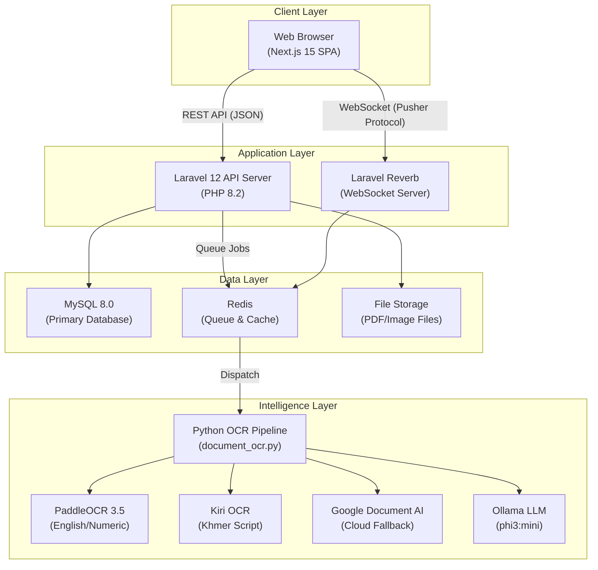
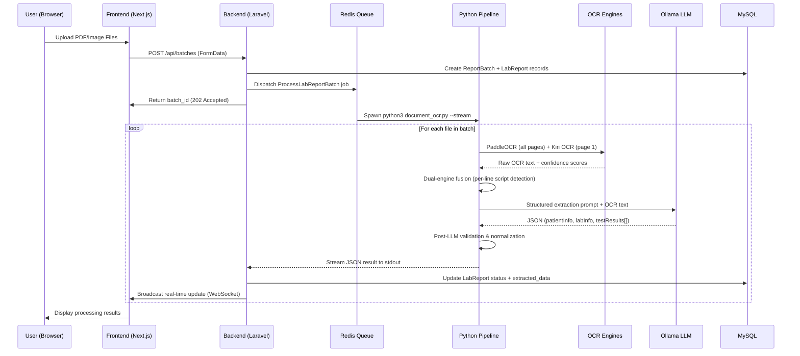
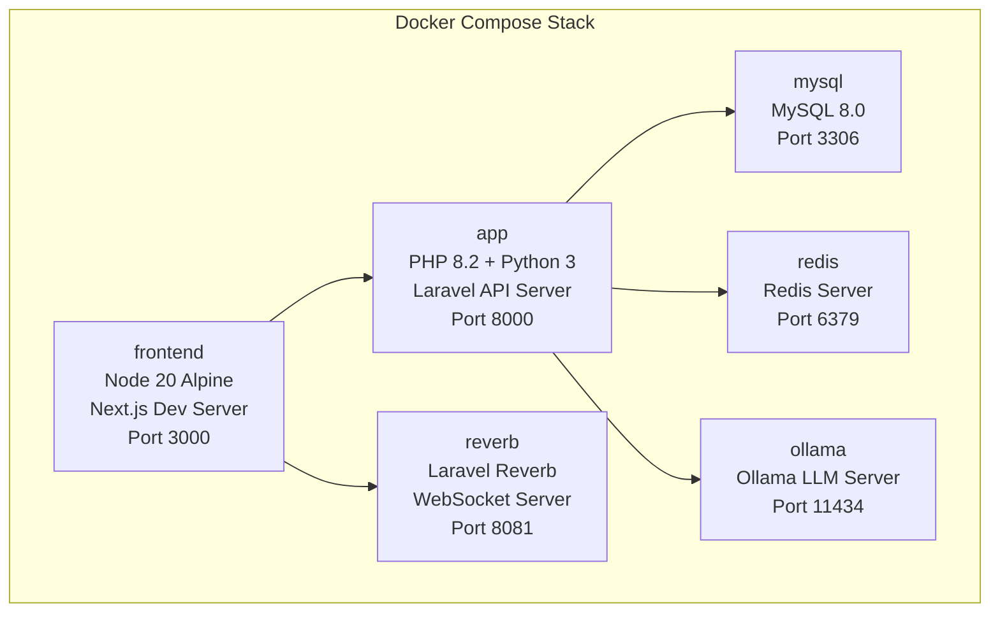
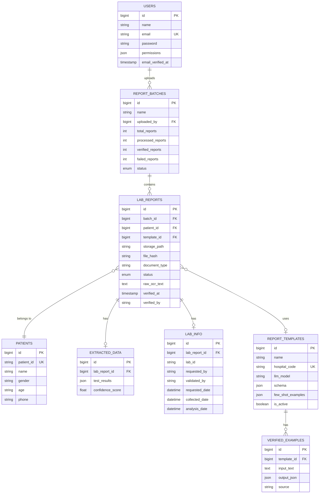
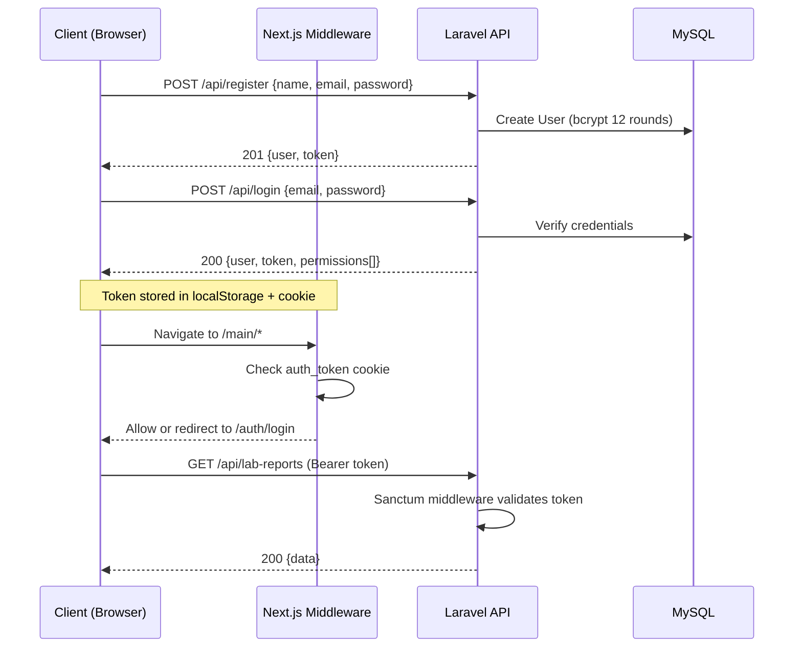

# Clinex — System Design Document

## 1. System Overview

**Clinex** is a clinical medical records digitization system designed to automate the extraction, structuring, and management of patient data from physical hospital documents (laboratory reports and consultation forms). The system leverages a multi-engine OCR pipeline augmented with a local Large Language Model (LLM) to convert scanned medical documents into structured, queryable digital records.

### 1.1 System Architecture Diagram



### 1.2 High-Level Data Flow



---

## 2. Technology Stack

### 2.1 Frontend

| Component | Technology | Version | Purpose |
|---|---|---|---|
| **Framework** | Next.js (App Router) | 15.3.4 | Server-side rendering, file-based routing, API routes |
| **UI Library** | React | 19.0.0 | Component-based user interface |
| **Language** | TypeScript | 5.x | Type-safe development |
| **Styling** | Tailwind CSS | 4.x | Utility-first CSS framework with class-based dark mode |
| **Icons** | Lucide React | 0.525.0 | SVG icon library |
| **Theme** | next-themes | 0.4.6 | Dark/light mode persistence |
| **Real-time** | Laravel Echo + Pusher.js | 2.1.6 / 8.4.0 | WebSocket client for live processing updates |
| **HTTP Client** | Custom `apiClient` | — | Fetch-based REST client with JWT auth |
| **State Management** | React Context API | — | AuthContext, ToastContext |
| **Font** | Inter | — | Google Fonts via `next/font` |
| **Linting** | ESLint | 9.x | Code quality with Next.js presets |

**Frontend Architecture:**

| Layer | Details |
|---|---|
| **Pages** | 22 routes total: 5 auth, 10 main (protected), 6 admin (role-gated), 1 API |
| **Components** | 7 reusable components across `auth/`, `layout/`, `theme/` directories |
| **Auth Strategy** | JWT tokens stored in `localStorage` + `httpOnly` cookies; middleware-based route protection |
| **API Communication** | REST over HTTPS to Laravel backend; WebSocket for real-time batch progress |

---

### 2.2 Backend

| Component | Technology | Version | Purpose |
|---|---|---|---|
| **Framework** | Laravel | 12.x | PHP web application framework |
| **Language** | PHP | 8.2 | Server-side programming |
| **API Auth** | Laravel Sanctum | 4.1 | Token-based SPA authentication |
| **Queue Dashboard** | Laravel Horizon | 5.47 | Redis queue monitoring & management |
| **WebSocket Server** | Laravel Reverb | 1.0 | Native PHP WebSocket server |
| **Social Auth** | Laravel Socialite | 5.21 | OAuth integration |
| **Database** | MySQL | 8.0 | Relational data storage (`utf8mb4_unicode_ci`) |
| **Cache/Queue** | Redis | — | Job queue broker + cache store (via `predis`) |
| **Testing** | Pest PHP | 3.8 | Testing framework |
| **Code Style** | Laravel Pint | 1.13 | PHP code formatter |

**Backend Architecture:**

| Layer | Count | Details |
|---|---|---|
| **Eloquent Models** | 10 | User, LabReport, Patient, Template, ReportTemplate, ReportBatch, ExtractedData, ExtractedLabInfo, PasswordOtp, VerifiedExample |
| **Controllers** | 23 | 13 main + 10 auth controllers |
| **API Routes** | ~64 | RESTful endpoints with permission-based middleware |
| **Background Jobs** | 6 | ProcessLabReportBatch, ProcessSingleLabReport, ProcessLabReport, ManualProcessLabReport, ProcessPdfForExtraction, CreateTemplateFromPdf |
| **Service Classes** | 5 | LabReportParserService, ReportParserService, DocumentAiService, TemplateZonesService, TemplateAnalyzerService |
| **Database Tables** | ~17 | Including `users`, `lab_reports`, `patients`, `report_batches`, `extracted_data`, `lab_info`, `report_templates`, `verified_examples`, etc. |
| **Migrations** | 18 | Schema version control |
| **Middleware** | 1 custom | `CheckPermission` — role-based access control (`manage_users`, `manage_templates`, `manage_reports`, `view_analytics`, `view_system_health`) |

---

### 2.3 AI/OCR Intelligence Layer

The core innovation of Clinex is a **multi-engine OCR pipeline** with an LLM-based structured extraction layer, implemented as a Python subsystem (`document_ocr.py`, 2,448 lines).

#### 2.3.1 OCR Engine Architecture

```mermaid
graph LR
    subgraph "Input"
        PDF["PDF / Image File"]
    end

    subgraph "OCR Tier 1: Local Engines"
        P["PaddleOCR 3.5<br/>English + Numeric<br/>(All Pages)"]
        K["Kiri OCR 0.2.15<br/>Khmer Script<br/>(First Page Only*)"]
    end

    subgraph "OCR Tier 2: Fusion"
        FUSE["Per-Line Script Detection<br/>Khmer lines → Kiri<br/>English lines → Paddle<br/>Mixed → Higher confidence"]
    end

    subgraph "OCR Tier 3: Cloud Fallback"
        G["Google Document AI<br/>Form Parser<br/>(if confidence < 0.85)"]
    end

    subgraph "Intelligence Layer"
        LLM["Ollama LLM (phi3:mini)<br/>Structured JSON Extraction<br/>4096 token context"]
        REGEX["Regex Fallback Parser<br/>(if LLM unavailable)"]
    end

    subgraph "Post-Processing"
        VAL["Validation & Normalization<br/>Flag enforcement (H/L/null)<br/>Unit cleanup<br/>Name deduplication"]
        ANC["Hospital Anchor Override<br/>Known-good header values"]
    end

    PDF --> P
    PDF --> K
    P --> FUSE
    K --> FUSE
    FUSE -->|"confidence ≥ 0.85"| LLM
    FUSE -->|"confidence < 0.85"| G
    G --> LLM
    LLM -->|"success"| VAL
    LLM -->|"failure"| REGEX
    REGEX --> VAL
    VAL --> ANC
    ANC --> OUTPUT["Structured JSON Output"]
```



> **\*** For lab reports, Kiri OCR processes only the first page (patient demographics with Khmer names). For consultation forms, Kiri OCR processes all pages.

#### 2.3.2 OCR Engine Specifications

| Engine | Type | Specialization | GPU | Confidence Threshold |
|---|---|---|---|---|
| **PaddleOCR 3.5** | Local | Structured English text, numeric tables, dates, IDs | CUDA (RTX 3060) | 0.85 |
| **Kiri OCR** | Local | Khmer Unicode script (transformer-based) | CUDA (RTX 3060) | 0.70 |
| **Google Document AI** | Cloud | General-purpose document understanding (Form Parser) | N/A (cloud) | N/A (fallback) |

**Dual-Engine Fusion Algorithm:**
The system employs a per-line script detection algorithm to select the optimal OCR output:

1. For each line of OCR text, compute the ratio of Khmer Unicode characters (U+1780–U+17FF)
2. If Khmer ratio > 30% → select Kiri OCR output for that line
3. If Khmer ratio < 5% → select PaddleOCR output for that line
4. For mixed lines → select the engine with higher per-line confidence score
5. Fused confidence = weighted average based on contributing line counts

#### 2.3.3 LLM Extraction (Ollama)

| Parameter | Value |
|---|---|
| **Model** | Microsoft Phi-3 Mini (`phi3:mini`) |
| **Host** | `http://ollama:11434` (Docker service) |
| **API Endpoint** | `/api/chat` |
| **Temperature** | 0 (deterministic) |
| **Context Window** | 4,096 tokens |
| **Output Format** | Structured JSON via Ollama schema enforcement |
| **Timeout** | 60 seconds |

**Prompt Engineering Strategy:**

The LLM system prompt includes:
- **14 strict extraction rules** covering data formats, ID patterns, and gender normalization
- **Fuzzy label mapping** for OCR-corrupted Khmer labels (e.g., `ឈ្មោះ/Name` → Patient Name)
- **English priority rule** for physician names (ignore garbled Khmer near signatures)
- **Unit normalization directives** (e.g., `응` → `%`, `dlL` → `dL`)
- **Few-shot examples** from verified training data (adaptive, template-specific)
- **Strict flag enum enforcement** (`H`, `L`, or `null` only — never `NEGATIVE`/`POSITIVE`)

#### 2.3.4 Post-LLM Validation Pipeline

| Stage | Operation |
|---|---|
| **Flag Enforcement** | Any flag value not in `{H, L}` is set to `null` |
| **Unit Normalization** | Regex-based cleanup of 10+ OCR unit corruptions |
| **Result Normalization** | Collapse errant spaces in decimals (`0 . 7` → `0.7`) |
| **Reference Range Cleanup** | Strip LaTeX wrappers, fix double-dot artifacts |
| **Test Name Cleanup** | Fix OCR double-char typos (`Chollesterole` → `Cholesterol`) |
| **ID Validation** | Patient ID must match `^PT\d+$`, Lab ID must match `^LT\d+$` |
| **Gender Normalization** | Map OCR variants (`Feemale`, `Maale`) to canonical `Male`/`Female` |
| **Physician Name Cleanup** | Strip non-ASCII characters, fix double dots |
| **Category Normalization** | `BIOCHIMISTRY` → `BIOCHEMISTRY`, `ENNZYMOLOGY` → `ENZYMOLOGY` |
| **Hospital Anchor Override** | Known hospitals (e.g., `KV Hospital`) bypass OCR for header fields |

#### 2.3.5 Python Dependencies

| Package | Version | Purpose |
|---|---|---|
| `paddlepaddle` | 3.3.1 | Deep learning framework for PaddleOCR |
| `paddleocr` | 3.5.0 | OCR text recognition engine |
| `kiri-ocr` | ≥0.2.15 | Khmer-specialized transformer OCR |
| `google-cloud-documentai` | ≥2.30.0 | Google Document AI client |
| `google-auth` | ≥2.35.0 | GCP authentication |
| `PyMuPDF` | ≥1.24.13 | PDF page rendering to images |
| `pdfplumber` | ≥0.11.4 | PDF text extraction fallback |
| `PyPDF2` | ≥3.0.1 | PDF utilities |
| `Pillow` | ≥10.4.0 | Image preprocessing (grayscale, contrast, sharpen) |
| `numpy` | ≥1.21.0 | Numerical operations |
| `requests` | ≥2.31.0 | HTTP client for Ollama API |
| `torch` + `torchvision` | — | PyTorch runtime for Kiri OCR transformer |
| `opencv-python-headless` | ≥4.9.0 | Computer vision utilities |

---

### 2.4 Infrastructure & DevOps

| Component | Technology | Purpose |
|---|---|---|
| **Containerization** | Docker + Docker Compose | Multi-service orchestration |
| **PHP Base Image** | `php:8.2-cli-bookworm` | Backend runtime (Debian Bookworm) |
| **Node Base Image** | `node:20-alpine` | Frontend runtime |
| **Queue Manager** | Laravel Horizon | Redis queue monitoring, worker management |
| **WebSocket** | Laravel Reverb | Real-time event broadcasting (port 8081) |
| **Process Manager** | Symfony Process | PHP-to-Python subprocess orchestration |
| **GPU Runtime** | NVIDIA CUDA | PaddleOCR + Kiri OCR GPU acceleration |
| **PDF Rendering** | Ghostscript 10.05.1 | PDF-to-image conversion |

**Docker Services:**



---

## 3. Database Schema

### 3.1 Entity Relationship Diagram



### 3.2 Key Tables Summary

| Table | Records | Purpose |
|---|---|---|
| `users` | System users | Authentication, roles, permissions |
| `report_batches` | Upload groups | Batch tracking with progress counters |
| `lab_reports` | Individual reports | File metadata, processing status, verification state |
| `patients` | Patient records | Deduplicated patient demographics |
| `extracted_data` | OCR results | Structured test results (JSON) with confidence scores |
| `lab_info` | Lab metadata | Physician, dates, lab/patient IDs |
| `report_templates` | Hospital templates | Per-hospital schema, LLM model, few-shot examples |
| `verified_examples` | Training data | Admin-curated input→output pairs for LLM few-shot learning |

---

## 4. API Architecture

### 4.1 Route Groups

| Group | Prefix | Auth | Permission | Routes |
|---|---|---|---|---|
| Authentication | `/api/` | Public | — | 6 (register, login, OTP reset ×3, logout) |
| User Management | `/api/users` | Sanctum | — | ~7 |
| Profile | `/api/profile` | Sanctum | — | 3 |
| Lab Reports | `/api/lab-reports` | Sanctum | — | ~8 |
| Batches | `/api/batches` | Sanctum | — | ~9 |
| Patients | `/api/patients` | Sanctum | — | ~7 |
| Templates | `/api/templates` | Sanctum | — | 1 |
| Admin Dashboard | `/api/admin/dashboard` | Sanctum | `view_analytics` | 1 |
| Admin Users | `/api/admin/users` | Sanctum | `manage_users` | ~4 |
| Admin Templates | `/api/admin/templates` | Sanctum | `manage_templates` | ~5 |
| Admin Reports | `/api/admin/reports` | Sanctum | `manage_reports` | ~3 |
| Admin System | `/api/admin/system-health` | Sanctum | `view_system_health` | 1 |
| Admin Training | `/api/admin/training-data` | Sanctum | `manage_templates` | ~5 |
| Health Check | `/api/health` | Public | — | 1 |
| **Total** | | | | **~64 routes** |

### 4.2 Authentication Flow



---

## 5. Security Model

| Layer | Mechanism | Details |
|---|---|---|
| **Authentication** | Laravel Sanctum (Bearer tokens) | Token-based SPA authentication |
| **Password Hashing** | bcrypt | 12 rounds |
| **Password Reset** | OTP-based | 6-digit OTP via email (Mailtrap in dev) |
| **Session** | Database-backed | Encrypted, 120-minute lifetime |
| **Route Protection** | Middleware | Next.js middleware (frontend) + Sanctum (backend) |
| **Permission System** | JSON permissions field | `manage_users`, `manage_templates`, `manage_reports`, `view_analytics`, `view_system_health` |
| **CORS** | Configured | Dynamic origin from `FRONTEND_URL`, credentials supported |
| **File Validation** | Server-side | MIME type + extension + file hash (SHA-256) for duplicate detection |
| **Medical Data** | Encrypted sessions | Session encryption enabled for PHI protection |

---

## 6. Deployment Architecture

### 6.1 Hardware Requirements

| Component | Minimum | Recommended |
|---|---|---|
| **GPU** | NVIDIA GTX 1650 (4GB VRAM) | NVIDIA RTX 3060 (6GB VRAM) |
| **RAM** | 8 GB | 16 GB |
| **Storage** | 20 GB | 50 GB (for document archives) |
| **CPU** | 4 cores | 8 cores |

### 6.2 Container Architecture

| Container | Base Image | Ports | GPU |
|---|---|---|---|
| `app` | `php:8.2-cli-bookworm` + Python 3 | 8000 | ✅ (PaddleOCR + Kiri OCR) |
| `frontend` | `node:20-alpine` | 3000 | — |
| `mysql` | `mysql:8.0` | 3306 | — |
| `redis` | `redis:alpine` | 6379 | — |
| `ollama` | `ollama/ollama` | 11434 | ✅ (phi3:mini inference) |
| `reverb` | Shared with `app` | 8081 | — |

### 6.3 Processing Performance

| Metric | Value |
|---|---|
| **Throughput** | ~4 files per batch (max 20) |
| **Per-file processing** | ~60–90 seconds (GPU-accelerated) |
| **OCR engines per file** | PaddleOCR (all pages) + Kiri OCR (page 1) |
| **LLM context window** | 4,096 tokens |
| **Queue workers** | 1 (serialized for GPU memory safety) |
| **Batch timeout** | 7,200 seconds (2 hours) |

---

## 7. Document Processing Pipeline — Detailed

### 7.1 Supported Document Types

| Type | Pages | OCR Strategy | Example |
|---|---|---|---|
| **Laboratory Report** | 1–5 pages | PaddleOCR (all pages) + Kiri OCR (page 1 only) | CBC, Biochemistry, Urinalysis panels |
| **Patient Consultation** | 1–2 pages | PaddleOCR (all pages) + Kiri OCR (all pages) | Vital signs, chief complaint, prescriptions |

### 7.2 Supported File Formats

| Format | MIME Type |
|---|---|
| PDF | `application/pdf` |
| JPEG | `image/jpeg` |
| PNG | `image/png` |
| TIFF | `image/tiff` |
| BMP | `image/bmp` |
| GIF | `image/gif` |
| WebP | `image/webp` |

### 7.3 Extracted Data Schema (Laboratory Report)

```json
{
  "patientInfo": {
    "name": "KAUN KIMLANG",
    "patientId": "PT002047",
    "age": "24Y, 10M, 29D",
    "gender": "Female",
    "phone": null
  },
  "labInfo": {
    "labId": "LT001336",
    "requestedBy": "Dr. LEANG Choeu",
    "requestedDate": "31/03/2024 08:46",
    "collectedDate": "31/03/2024 11:07",
    "analysisDate": "31/03/2024 11:07",
    "validatedBy": "Hok Mengchhay"
  },
  "testResults": [
    {
      "testName": "Creatinine, serum",
      "result": "0.7",
      "unit": "mg/dL",
      "referenceRange": "(0.9 - 1.1)",
      "flag": "L",
      "category": "BIOCHEMISTRY"
    }
  ]
}
```

### 7.4 Test Categories Supported

| Category | Example Tests |
|---|---|
| **BIOCHEMISTRY** | Creatinine, Urea/BUN, Glucose, Cholesterol (Total/HDL/LDL), Triglyceride, Uric Acid |
| **ENZYMOLOGY** | SGPT/ALT, SGOT/AST |
| **HEMATOLOGY** | WBC, RBC, HGB, HCT, MCV, MCH, MCHC, PLT, Lymphocyte %, Monocyte %, Neutrophil % |
| **SERO/IMMUNOLOGY** | HBsAg, Anti-HCV, HIV, RPR/VDRL |
| **URINE ANALYSIS** | LEU, NIT, URO, PRO, pH, Blood, SG, KET, BIL, GLU, ASC |
| **DRUG URINE** | Amphetamine, Methamphetamine, THC, Morphine |
| **BLOOD GROUP** | ABO + Rh typing |

---

## 8. Technology Selection Justification

| Decision | Choice | Rationale |
|---|---|---|
| **Frontend Framework** | Next.js 15 (App Router) | Server-side rendering for SEO, file-based routing, React 19 support |
| **Backend Framework** | Laravel 12 | Mature ecosystem, built-in queue/WebSocket/auth, strong ORM |
| **Primary OCR** | PaddleOCR | Best accuracy for structured English/numeric medical data; GPU-accelerated |
| **Khmer OCR** | Kiri OCR | Only production-grade Khmer script transformer model available |
| **Cloud OCR Fallback** | Google Document AI | Industry-leading accuracy when local engines produce low-confidence results |
| **Local LLM** | Ollama + Phi-3 Mini | Runs entirely on-premises (data privacy for medical records); structured JSON output |
| **Database** | MySQL 8.0 | ACID compliance for medical data integrity; `utf8mb4` for Khmer text storage |
| **Queue** | Redis + Horizon | High-throughput job processing with real-time monitoring dashboard |
| **Real-time** | Laravel Reverb | Native PHP WebSocket — no external service dependency |
| **Containerization** | Docker Compose | Reproducible multi-service deployment; GPU passthrough for OCR/LLM |
